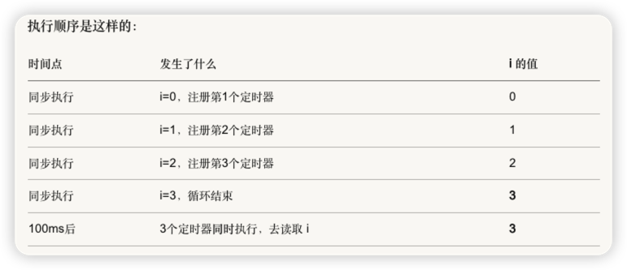
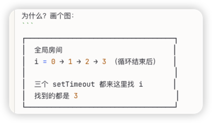

# 作用域


# 1-为什么需要作用域

假设没有作用域所有变量都是全局的

```js
var a = 1;

function foo() {
  var a = 2;  // 这会覆盖外面的 a
}

foo();
console.log(a);  // 2 —— 被污染了！
```


# 2-作用域是怎么工作的


### 先看个经典面试题

```js
for (var i = 0; i < 3; i++) {
  setTimeout(() => console.log(i), 100);
}
// 输出：3, 3, 3

```

100ms后 3个定时器同时执行，去读取i






### 拆解 为什么let会输出 0 1 2


let声明的变量不是全局变量 被 for循环（）代码块限制了let的作用域
var i也是写在for循环的()这个代码块里，但关键就在于：var完全无视「代码块」的作用域限制，而let会严格遵守「代码块」的作用域限制，这是两者最本质的区别。
先把核心逻辑讲透
JavaScript 里的「作用域限制规则」对var和let是两套完全不同的规则：
对var来说：只有函数体（function(){}）能限制它的作用域，任何代码块（for()/if(){}/{}）都不行；
对let来说：任何代码块（包括for()/if(){}/{}）都能限制它的作用域，普通的小括号只是运算优先级不创建作用域


#  3-JavaScript作用域

## 概述
作用域分为静态作用域即词法作用域 和 动态作用域：
- 静态作用域意味着它与代码的位置有关，与执行代码时的环境无关，JavaScript采用的是静态作用域
- 动态即运行时作用域，代码执行时确定的。

JavaScript的作用域可以分为以下四种：
- 全局作用域： 脚本模式运行所有代码的默认作用域
- 函数作用域：由函数创建的作用域，--只有函数作用域哥们能管住var关键字
- 块级作用域：用一对花括号（一个代码块）创建出来的作用域
- 模块作用域： 模块模式中运行代码的作用域


## 函数作用域

函数内声明的变量，只能在函数作用域范围内访问

var只会认函数作用域其他的 花括号 代码块不认的 只认函数的花括号

```js
function scope() { var agi = "gemini"; } console.log(agi); // Uncaught ReferenceError: address is not defined
```

## 块级作用域


块级作用域对变量来说，可以简单理解为程序能够访问到变量的范围，超过作用域的就无法访问

let 和 const 支持块级作用域，如果在代码块 `{...}` 中使用let 或 const声明一个变量，那么变量只在该代码块这个作用域中可见就是可以被访问。


```js
{
// 作用域 A, 可以访问变量 x 
const x = 0; console.log(x); // 0 
 { 
  // 作用域 B, 可以访问 x、y 
  const y = 1; 
  console.log(x); // 0 
  console.log(y); // 1 
  } 
  // 作用域 A 外, 不能访问 x、y
  console.log(x); // 报错: Uncaught ReferenceError: x is not defined
}
```


# 作用域的本质

1.作用域 ----------- 变量住在哪个房间

2.作用域链 --------- 程序找变量时从里往外找的路径

3.var ------------- 房间的边界是函数 只认函数的花括号{}

4.let/const ------- 房间的边界是花括号 {}


                    ┌─────────────────────────────────────┐
                    │             热爱（根基）             │
                    │   持续动力 · 不会倦怠 · 长期主义      │
                    └──────────────────┬──────────────────┘
                                       │
                    ┌──────────────────┴──────────────────┐
                    │                                     │
                    ▼                                     ▼
        ┌───────────────────┐                 ┌───────────────────┐
        │                   │                 │                   │
        │    产品轮（深度）   │ ◀───────────▶ │    内容轮（广度）   │
        │                   │                 │                   │
        │  • 解决真实问题    │                 │  • 建立信任       │
        │  • 产生收入       │                 │  • 积累影响力      │
        │  • 积累经验       │                 │  • 获取流量       │
        │  • 验证认知       │                 │  • 收集需求       │
        │                   │                 │                   │
        └─────────┬─────────┘                 └─────────┬─────────┘
                  │                                     │
                  │         互相喂养                     │
                  │                                     │
                  │    产品给内容提供素材                 │
                  │    内容给产品带来用户                 │
                  │    用户给产品提供反馈                 │
                  │    反馈给内容提供选题                 │
                  │                                     │
                  └──────────────┬──────────────────────┘
                                 │
                                 ▼
                    ┌─────────────────────────────────────┐
                    │              复利效应               │
                    │                                     │
                    │   产品越多 → 收入越稳               │
                    │   内容越多 → 流量越大               │
                    │   时间越长 → 信任越深               │
                    │   经验越多 → 判断越准               │
                    │                                     │
                    └─────────────────────────────────────┘
找到热爱 → 用产品验证 → 用内容放大 → 用反馈迭代 → 循环往复 → 复利人生


