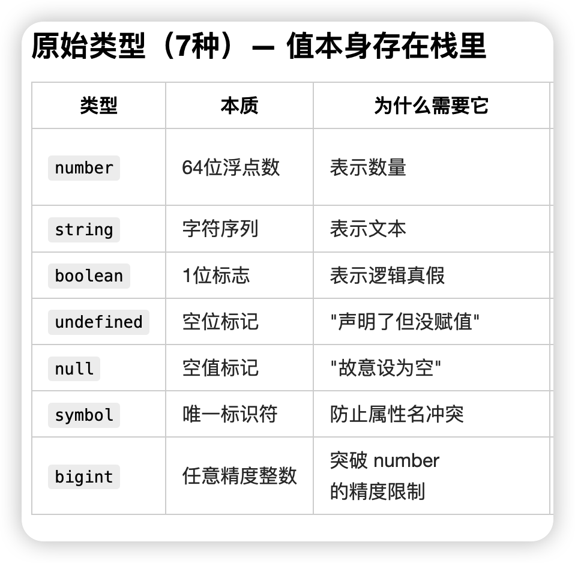

# JavaScript数据类型有哪些

JavaScript中数据类型有两类，分别是基本数据类型和引用数据类型，基本数据类型也称为原始数据类型，引用数据类型
也称为复杂数据类型，总共8种数据类型。

## 原始数据类型 7个

### number
number它能精确表示的整数范围是 ±(2^53 - 1)（超过这个范围的整数会丢失精度）。

### bigint
用于任意长度的整数

### string
string 字符和字符串都用string，没有char类型，不管是 1 个字符还是 N 个字符，都统一用string类型：
存单个字符：let c = "a"（用引号包裹，本质是长度为 1 的字符串）；
存多个字符：let s = "hello"（同样是 string 类型）。
JS 里没有 “字符类型” 的概念，所有字符相关的内容都归到string里。

### boolean
表示逻辑真假，用于true和false

### null
用于未知的值，只有一个null值的独立类型
空值标记 故意设置为空

### undefined
只声明未赋值，空位标记，只有一个undefined值的独立类型

### symbol
用于唯一的标识符

## 引用数据类型

Object用于复杂的数据结构，以下类型都是对象
### Function 函数

### Array 数组

### Date 日期

### RegExp 正则表达式

