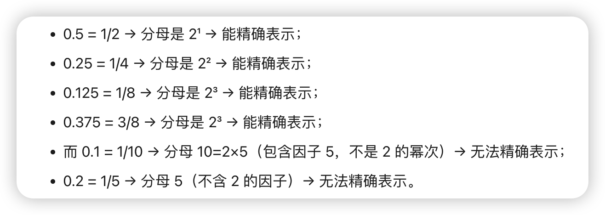

# 为什么0.1+0.3不等于0.3

首先要清楚这个不是JavaScript的bug，是 IEEE 754 浮点数标准的限制。
二进制无法精确计算十进制的小数
十进制的 0.1 和 0.2 无法被二进制精确， 也就是说 0.1和0.2在二进制的世界里面就是无限循环小数
## 小数精度损失
引擎会对 0.1 和 0.2 的二进制无限循环数进行 “四舍五入” 截断，只保留前 52 位有效数字 —— 这一步就已经产生了「微小的精度误差」（类似于十进制中把0.3000000000000000444089209850062616169452667236328125  截断为 0.30000000000000004）。

## 整数精度损失

64 位浮点数（IEEE 754）能精确表示的最大整数是 2^53 - 1（约等于 9007199254740991，共 16 位数字）。
超过这个数的整数，无法被 64 位浮点数精确存储 —— 因为浮点数的 “52 位有效数字位” 已经不够用了，只能用 “近似值” 存储。

```js
console.log(9999999999999999); //16位

// 答案是 10000000000000000 17位

```

打印的9999999999999999（16 位），比2^53 - 1（9007199254740991）要大：
2^53 - 1 = 9007199254740991（16 位）
你的数是9999999999999999（16 位），已经超过了 “精确表示的最大整数”。


## 二进制能精确表示的小数
二进制可以精确表示分母是 2 的幂次的十进制小数（比如 0.5、0.25、0.125 等），而 0.5 刚好符合这个规则，所以能被二进制精确表示。
核心规则：二进制能精确表示的十进制小数
一个十进制小数 x = 分子/分母，当分母能被 2 的幂次（2¹、2²、2³…）整除时，它就能被二进制精确表示。



## 解决方案

### 方案1 toFixed(n)
```js
let sum = 0.1 + 0.2
console.log(sum) // 30000000000000004
console.log(sum.toFixed(2)); // 0.30 string类型
// 可以使用一元加号将其强制转化为一个数字
console.log( +sum.toFixed(2) ); // 0.3

```


### 方案2 数字乘以100，将其转换为整数，进行数学运算
有个核心误区  js精度的 四舍五入

```js
console.log( (0.1 * 100 + 0.2 * 100) / 100); // 0.3

```


#### 方案2核心误区
```
为什么0.1+0.2 结果是0.30000000000000004， 数字乘以100将其转换成整数在运算结果就是0.3 本质也是有精度损失的 四舍五入后刚好也就满足条件
乍一看觉得最后一位是 4 应该被舍掉，但核心误区是：你看到的0.30000000000000004是 “简化显示结果”，它的底层实际存储值，并不是以 4 结尾的短小数，而是一个更长的小数，其有效数字超出了 JS 的 15-17 位显示精度，且前 17 位有效数字的误差已经无法被 “舍掉”。
第一步：先看0.1 + 0.2的真实存储值（不是短小数，是长小数）
0.1 + 0.2的底层实际存储的十进制值是：0.3000000000000000444089209850062616169452667236328125

```


### 方案3 用`Number.EPSILON`判断浮点数近似相等
1. **核心逻辑**：如果两个数的差值小于`Number.EPSILON`（浮点数的最小精度误差范围），则认为两数相等。
2. **`Number.EPSILON`的定义**：表示`1`与`Number`可表示的“大于1的最小浮点数”之间的差值（是JS中浮点数能区分的最小精度间隔）。
3. **实现函数**：
   ```javascript
   function numbersCloseEnoughToEqual(n1, n2) {
     return Math.abs(n1 - n2) < Number.EPSILON;
   }
   ```
4. **示例验证**：
   - `let a = 0.1 + 0.2; let b = 0.3;`
     - `numbersCloseEnoughToEqual(a, b); // true`（0.1+0.2与0.3的误差在允许范围内）
   - `numbersCloseEnoughToEqual(0.000001, 0.000002); // false`（差值超过精度范围）