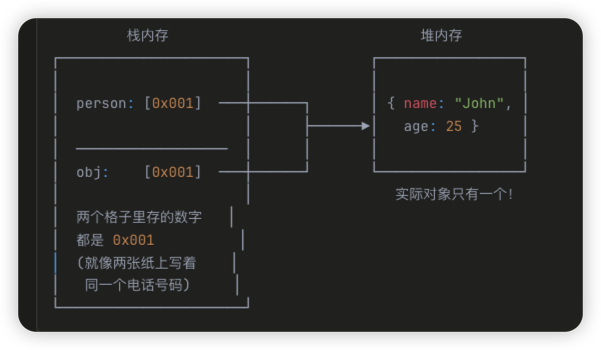
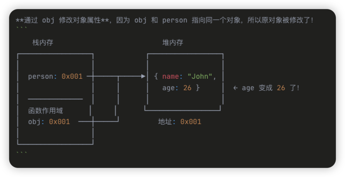
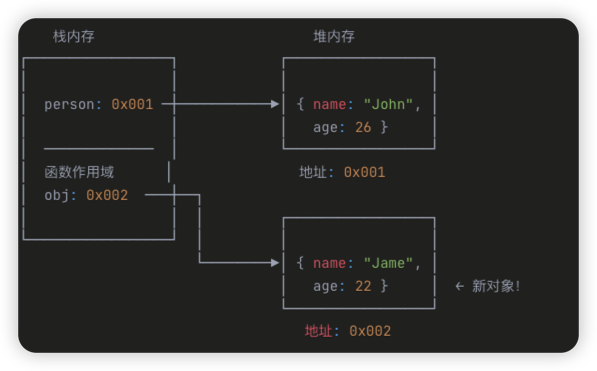
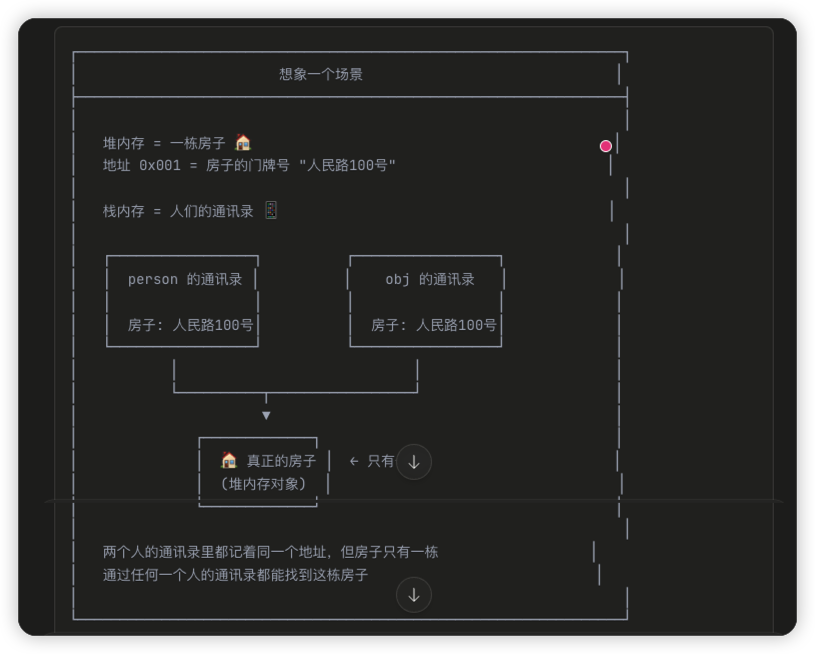
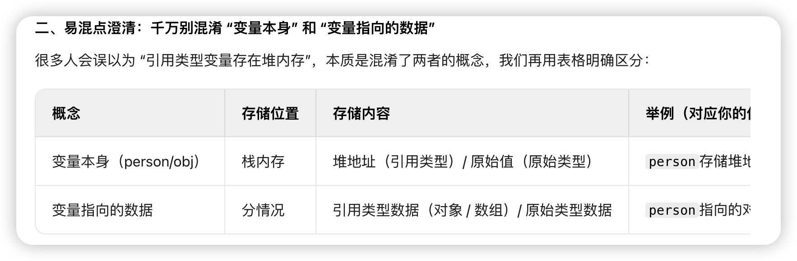
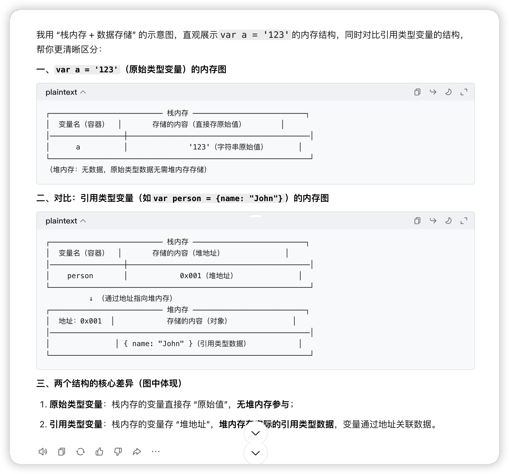

# 原始数据类型和引用数据类型的区别

JavaScript 的数据类型设计，本质上是在回答一个问题：**数据在内存中怎么存储和访问？**

## 一、最底层的划分：两种存储方式
```text
┌─────────────────────────────────────────────────────┐
│                     内存                             │
├────────────────────┬────────────────────────────────┤
│       栈 Stack     │          堆 Heap               │
│    (小、快、固定)   │      (大、灵活、动态)           │
├────────────────────┼────────────────────────────────┤
│   原始类型的值      │      引用类型的实际数据          │
│   引用类型的地址    │                                │
└────────────────────┴────────────────────────────────┘
```


## 案例1 打印结果是多少
```js
// 原始数据类型与引用数据类型

let person = {
  name: "John",
  age: 25
}

function increaseAge(obj) {
  obj.age += 1;
  obj = {name: "Jame", age: 22};
  console.log(obj); // 1
}

increaseAge(person);
console.log(person); // 2
```

### 拆解案例1 

#### 传参/赋值



实际对象只有一个存储在堆内存，person和obj指向同一个对象

栈内存里面存了 person变量 和 obj变量他们都保存了地址

函数传参 = 赋值 = 复制地址值 != 拷贝对象


#### 执行obj.age += 1

对象的地址没有变，对象的属性变成26了



#### 执行obj赋值对象操作

`obj = { name: "Jame", age: 22 }`

**关键点**：这里是给 `obj` **重新赋值**，让它指向一个**新对象**！

注意 const声明的值不会变不会指向新对象



现在 obj 和 person指向不同的对象了

#### 拆解打印结果
```js
console.log(obj) 
// 输出 { name: "Jame", age: 22 } 
// 因为 obj 现在指向新对象 0x002
```

函数执行完毕

`console.log(person)` 输出 `{ name: "John", age: 26 }`

## 误区 栈里面存地址本身吗

栈里存的不是"地址本身"，而是"地址的值"

可以有多个变量存储相同的地址值，就像多个人可以记住同一个门牌号一样。



## 误区2 变量赋值过程 变量存储在哪里

person变量 和 obj变量都存储在栈内存 携带了指向堆内存的信息 

变量既然是引用数据类型为啥存储在栈内存

| 概念 | 存储位置 | 对应类型 | 举例（针对你的代码） |
|------|---------|---------|---------------------|
| 变量本身（变量名） | 栈内存 | 无类型（仅存 "值 / 地址"） | person、obj这两个变量名，一定存在栈中 |
| 变量指向的数据 | 分情况 | 原始类型 / 引用类型 | person指向的对象（引用类型）→ 堆内存；let a = 10中a指向的 10（原始类型）→ 栈内存 |

JavaScript 是一种「弱类型语言」（也叫「动态类型语言」），核心特征之一就是变量本身不绑定任何数据类型，它就像一个 "万能容器"（空盒子），可以随时存放任意类型的数据，且存放的数据类型可以动态改变。
举例验证（变量本身无类型，可随意存放不同类型数据）：


###  变量本身与变量指向的数据


### 堆内存的name和age是变量吗
堆内存的 name age是变量吗 还是 键值对

**变量是独立的存储容器 只存储在栈内存**

堆内存里的name和age不是 "变量"，而是对象的 "键（属性名）"，它们和对应的值（"John"、26）共同组成键值对（对象的属性结构）。
具体区分：
变量 vs 对象的键：
变量：是独立的存储容器（如person、obj），存在栈内存，用于存储原始值或堆地址；
对象的键（如name、age）：是对象内部的 "属性标识"，仅属于当前对象，不是独立变量 —— 它的作用是标识对象内对应的 "值"，只能通过 "对象。键"（如person.name）的方式访问，无法单独作为变量使用。
堆内存中的结构：你图里堆内存的 `{name: "John", age: 26}` 是一个对象，对象的本质是 "键值对的集合"：
name是键（属性名），"John"是对应的值；
age是键（属性名），26是对应的值；
这些键值对是对象的 "内部属性"，依附于对象存在，不是独立的变量。


### 变量 引用类型 数据关系



**总结**：变量本身在栈内存的物理地址无需开发者考虑，变量名间接表示了这个地址。
