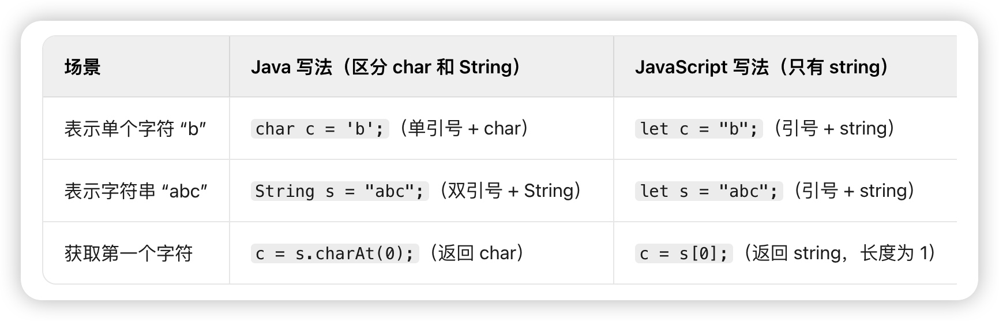

我来用第一性原理帮你拆解这一章的核心知识。

## 第一性原理：一切从"内存"开始

JavaScript 的数据类型设计，本质上是在回答一个问题：**数据在内存中怎么存储和访问？**

---

## 一、最底层的划分：两种存储方式

```
┌─────────────────────────────────────────────────────┐
│                     内存                             │
├────────────────────┬────────────────────────────────┤
│       栈 Stack     │          堆 Heap               │
│    (小、快、固定)   │      (大、灵活、动态)           │
├────────────────────┼────────────────────────────────┤
│   原始类型的值      │      引用类型的实际数据          │
│   引用类型的地址    │                                │
└────────────────────┴────────────────────────────────┘
```

**为什么这样设计？**

因为不同数据有不同特点：数字、布尔值等体积小且固定，直接放栈里效率高；对象、数组等体积大且可变，放堆里更灵活，栈里只存一个"指针"。

---

## 二、8 种数据类型的本质

### 原始类型（7种）— 值本身存在栈里

| 类型 | 本质 | 为什么需要它 | 补充 |
|------|------|-------------|-----|
| `number` | 64位浮点数 | 表示数量  | 可以表示整数也可以浮点数,整数精度有限制
| `string` | 字符序列 | 表示文本 | js做了简化没有单独的char字符类型
| `boolean` | 1位标志 | 表示逻辑真假 |
| `undefined` | 空位标记 | "声明了但没赋值" |
| `null` | 空值标记 | "故意设为空" |
| `symbol` | 唯一标识符 | 防止属性名冲突 |
| `bigint` | 任意精度整数 | 突破 number 的精度限制 |

number它能精确表示的整数范围是 ±(2^53 - 1)（超过这个范围的整数会丢失精度）。

string 字符和字符串都用string，没有char类型，不管是 1 个字符还是 N 个字符，都统一用string类型：
存单个字符：let c = "a"（用引号包裹，本质是长度为 1 的字符串）；
存多个字符：let s = "hello"（同样是 string 类型）。
JS 里没有 “字符类型” 的概念，所有字符相关的内容都归到string里。




### 引用类型（1种）— 栈里存地址，堆里存数据

| 类型 | 包含 |
|------|------|
| `Object` | 普通对象、Array、Function、Date、RegExp... |

---

## 三、由存储方式推导出的行为差异

```javascript
// 原始类型：复制值
let a = 1;
let b = a;
b = 2;
console.log(a); // 1（互不影响）

// 引用类型：复制地址
let obj1 = { x: 1 };
let obj2 = obj1;
obj2.x = 2;
console.log(obj1.x); // 2（指向同一块内存）
```

**这不是"特性"，而是存储方式的必然结果。**

---

## 四、类型判断的本质

**核心问题：怎么知道一个值是什么类型？**

| 方法 | 原理 | 局限 |
|------|------|------|
| `typeof` | 读取值的类型标签（底层二进制标记） | `null` 返回 `"object"`（历史 bug） |
| `instanceof` | 沿原型链查找构造函数 | 只能判断引用类型 |
| `Object.prototype.toString` | 读取内部 `[[Class]]` 标签 | 最准确，但写法繁琐 |
| `constructor` | 查看构造函数引用 | 可被篡改 |

---

## 五、类型转换的本质

**核心问题：不同类型的值如何互相转换？**

```
        显式转换                    隐式转换
    Number(), String()         运算符自动触发
            ↓                        ↓
    ┌───────────────────────────────────────┐
    │        转换规则（固定的）               │
    │   任何值 → 数字/字符串/布尔            │
    └───────────────────────────────────────┘
```

**隐式转换的两个关键场景：**

```javascript
// + 作为一元运算符 → 转数字
+"42"  // 42

// + 作为二元运算符（有字符串）→ 转字符串拼接
1 + "2"  // "12"
```

---

## 六、特殊值的设计哲学

### `0.1 + 0.2 !== 0.3`

不是 JS 的 bug，是 IEEE 754 浮点数标准的限制。二进制无法精确表示某些十进制小数。

**解决：** `Math.abs(a - b) < Number.EPSILON`

### `typeof null === "object"`

JS 第一版的 bug：用类型标签 `000` 表示对象，而 `null` 是全零，被误判。

### `NaN !== NaN`

IEEE 754 规定：NaN 不等于任何值，包括自己。用 `Object.is(NaN, NaN)` 返回 `true`。

---

## 七、比较操作的本质

```
       ==                ===              Object.is
        ↓                 ↓                   ↓
   先类型转换          不转换直接比较      不转换 + 特殊处理
   再比较值            类型不同就 false    NaN===NaN, +0≠-0
```

---

## 总结：一张图理清全部

```
                    JavaScript 数据
                          │
          ┌───────────────┴───────────────┐
          ↓                               ↓
      原始类型                          引用类型
    （栈中存值）                      （栈存地址）
          │                               │
    ┌─────┼─────┐                    Object
    ↓     ↓     ↓                   ↙  ↓  ↘
 number string boolean           Array Function Date
 null undefined symbol
 bigint
```

**记住核心逻辑链：**

存储方式 → 复制行为 → 比较行为 → 类型判断方法