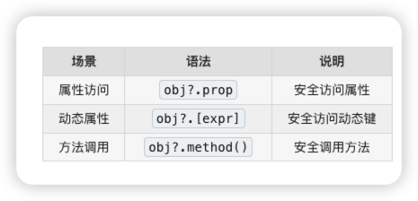

# 为什么要选择可选链?.

传统痛点：访问深层嵌套属性时，任何一层为 null/undefined 都会报错


## 对比传统写法 与 可选链
```
// 传统写法：层层判断，代码冗长
let city = user && user.address && user.address.city;

// 可选链写法：简洁优雅
let city = user?.address?.city;

```


## 三种使用场景



## 可选链等价代码
```
┌─────────────────────────────────────────────────────────┐
│                    可选链 ?. 核心逻辑                     │
├─────────────────────────────────────────────────────────┤
│                                                         │
│   obj?.prop  等价于  (obj == null) ? undefined : obj.prop │
│                                                         │
│   ┌──────────┐    ┌─────────────────┐                   │
│   │ 左侧求值  │───▶│ null/undefined? │                   │
│   └──────────┘    └────────┬────────┘                   │
│                       │         │                       │
│                      YES        NO                      │
│                       ▼         ▼                       │
│              ┌──────────┐  ┌──────────┐                 │
│              │返回undefined│  │继续访问右侧│                 │
│              └──────────┘  └──────────┘                 │
│                                                         │
└─────────────────────────────────────────────────────────┘

```

### 概述
**可选链 `?.` 的本质是「空值守卫」：只在左侧为 null/undefined 时短路返回 undefined，其他 falsy 值照常执行，配合 `??` 可优雅处理默认值。**
### 案例1
```
// 1. 基础用法
let person = {
  name: "zhangsan",
  details: { age: 20 }
};

console.log(person?.city);           // undefined（不报错）
console.log(person.city);            // undefined（碰巧不报错，因为person存在）
console.log(person?.address?.city);  // undefined（安全访问深层属性）

// 2. 方法安全调用
person.greet?.();  // 不报错，greet不存在时返回undefined

// 3. 配合空值合并 ?? 设置默认值
let city = person?.address?.city ?? '默认城市';
console.log(city);  // '默认城市'

// 4. 面试陷阱题
let obj = { a: { b: null } };
console.log(obj?.a?.b?.c);  // undefined（b是null，?.短路返回）
console.log(obj.a.b.c);     // TypeError: Cannot read property 'c' of null


```


