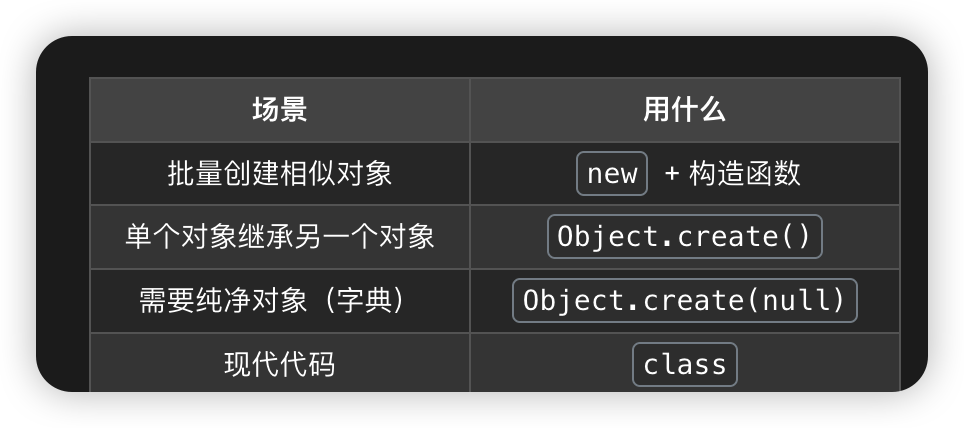

# js创建对象的方式概述


JavaScript中有八种数据类型，有七种基本数据类型和对象（Object），对象就是引用类型
创建JavaScript对象的方式有8种：

```
// 引用类型（都是对象）
let obj = {};            // 普通对象
let arr = [];            // 数组对象
let fn = function(){};   // 函数对象
let date = new Date();   // 日期对象
let reg = /abc/;         // 正则对象


```
**所有的构造函数 既是函数也是对象**
**引用数据类型**：`Object`、`Array`、`Function` 等属于对象既引用数据类型也是构造函数（存储在堆内存，变量保存的是堆内存的引用地址）。


## 1-三种最基本方式创建JavaScript对象

- Object构造函数
- 对象字面量
- Object.create原型链

## 2-类（语法糖）创建对象


## 3-四种基于原型继承方式

ES6开始正式支持类和继承，涵盖了之前规范设计的基于原型的继承方式

- 工厂模式
- 构造函数模式
- 原型模式
- 组合模式


# JavaScript对象的本质


## 对象组成

JavaScript中对象就是属性的集合 + 原型链

```
对象 =  {
  自有属性 (存储在对象本身)
  +
  原型链属性（[[Prototype]] 链接 指向另一个对象）
}
```

```
// 原型链的隐藏与 可见
const obj = { name: 'Alice' };

// ❌ 你看不到的（内部表示）
// [[Prototype]] ← 这是 ECMAScript 规范的内部插槽，代码无法直接访问

// ✅ 你能看到的（实际访问方式）
console.log(obj.__proto__);              // Object.prototype（非标准但可用）
console.log(Object.getPrototypeOf(obj)); // Object.prototype（标准方法）

```

## 自有属性&&原型链属性

自有属性的优先级更高

可以in查询遍历所有属性 包括自有属性 和 原型链属性
```js
function Person(name) {
  this.name = name;
}
Person.prototype.age = 18;

const p = new Person('Alice');

// 题目：以下输出什么？
console.log(p.name);  // 'Alice'（自有属性）
console.log(p.age);   // 18（原型属性）

console.log(p.hasOwnProperty('name'));  // true
console.log(p.hasOwnProperty('age'));   // false

console.log(Object.keys(p));  // ['name']（只有自有属性）

// 遍历所有属性（包括原型）
for (let key in p) {
  console.log(key);  // 'name', 'age'
}

// 只遍历自有属性
for (let key in p) {
  if (p.hasOwnProperty(key)) {
    console.log(key);  // 'name'
  }
}

```


## 为什么要用到原型链

本质是节省内存 高效复用 特别是对象的函数复用

案例1 没有原型链的世界

```js
// 创建1000个人
const people = [];
for (let i = 0; i < 1000; i++) {
  people.push({
    name: `Person${i}`,
    sayHi: function() {  // ❌ 每个对象都复制一份函数
      console.log(this.name);
    }
  });
}

// 问题：内存中有1000个相同的 sayHi 函数！
// 浪费内存：1000份函数 × 函数大小 = 巨大浪费

```

有原型链的世界

```js
// 创建1000个人
function Person(name) {
  this.name = name;  // 每个人有自己的名字
}

Person.prototype.sayHi = function() {  // ✅ 只有1份函数
  console.log(this.name);
};

const people = [];
for (let i = 0; i < 1000; i++) {
  people.push(new Person(`Person${i}`));
}

// 结果：1000个对象共享1个 sayHi 函数
// 节省内存：只存储1份函数

```


误区1 函数本体存放在堆内存吗

```
**在 JavaScript 中，只要你创建了函数（无论以哪种方式），函数的本体就一定会被存储在堆内存中**—— 栈内存里永远只存 “指向这个堆内存地址的引用”，不会存函数本身。

**“变量本身” 的理解**：你说的 “变量本身” 如果指「变量名」，那它永远在栈；如果指「变量的值」，则分类型 —— 基本类型值在栈，引用类型值（地址）在栈、本体在堆。
**函数参数也是变量**：函数的参数变量遵循同样规则，比如 `function test(num) { }`，调用 `test(18)` 时，参数 `num`（标识符 + 18）都在栈内存。
✅ **函数体（也就是函数的代码逻辑、函数本身）一定是存储在堆内存中的**，这是 JavaScript 内存分配的铁律，没有任何例外。

```


## 对象的级别
```js
function Person (name){
  this.name = name //构造函数创建对象有this
}

const p = new Person('lucy')
```


实例链 


p实例对象 --->Person.prototype 给实例继承的原型对象（继承原型对象）---->Fuction.prototype构造函数原型对象--->Object.prototype顶级原型对象--->null


`.__ptoto__` 向上找原型， .prototype当靶子被下级的`.__proto__`指向
只有Function.prototype是函数类型 其他的这个属性都是普通对象，虽然都是普通对象但是内存地址不同级别不同。


# 谈谈Object


## Object具备双层身份 
既是对象也是函数， 函数是一等公民，函数也是对象
所有的构造函数都是这样 既是函数也是对象

案例

```js
// JavaScript 中的设计原则：函数是一等公民，函数也是对象

// 证明1：函数可以有属性
function myFunc() {}
myFunc.prop = 'value';
console.log(myFunc.prop);  // 'value'

// 证明2：函数可以作为对象传递
const funcObj = myFunc;
console.log(typeof funcObj);  // 'function'
console.log(funcObj instanceof Object);  // true

// 证明3：Object 也遵循这个规则
console.log(typeof Object);  // 'function' typeof可以识别基础类型 和 函数
console.log(Object instanceof Object);  // true


```


Object的特殊性在于它是所有对象的祖先

```js
// Object 的特殊之处：它是所有对象的祖先

// 所有对象最终都继承自 Object.prototype
const arr = [];
const fn = function(){};
const date = new Date();

console.log(arr.__proto__.__proto__ === Object.prototype);   // true
console.log(fn.__proto__.__proto__ === Object.prototype);    // true
console.log(date.__proto__.__proto__ === Object.prototype);  // true

// 但 Object 本身也是对象，也继承自 Object.prototype
console.log(Object.__proto__.__proto__ === Object.prototype);  // true

```


## 构造函数与实例

```js
// 实例 = 通过构造函数创建出来的对象

// 例子1：数组实例
const arr = [1, 2, 3];
// arr 是变量名
// [1, 2, 3] 是数组对象，是 Array 的实例
console.log(arr instanceof Array);  // true

// 例子2：日期实例
const today = new Date();
// today 是变量名
// new Date() 创建的对象是 Date 的实例
console.log(today instanceof Date);  // true

// 例子3：函数实例
const fn = function(){};
// fn 是变量名
// function(){} 是函数对象，是 Function 的实例
console.log(fn instanceof Function);  // true


```


# JavaScript创建对象

## 概述

ES6时代用的最多的是
创建单个对象 直接字面量 {}
创建批量对象 使用class 类，类创建对象底层是 组合模式即 构造函数+原型链方法

创建对象进化的指标在 属性独立 方法是否共享 批量创建不消耗过多内存、支持类型识别 几个方面

创建对象的调用模式这一步是否用new：工厂模式不需要new
构造函数创建对象 new调用的底层逻辑  ：创建空对象  链原型 绑定this  返回值


##  一、三种基本创建方式

### 1- Object 构造函数


创建自定义对象可以创建Object的一个新实例，再添加属性和方法

这是最基础的创建对象


```js

// Object构造函数创建对象

  

let person = new Object();

  

// 添加属性

person.name = "lucy";

  

// 添加方法

person.sayName = function() {

person.sayName = function() {

console.log(this.name)

}

}
```

拆解底层实现

### 本质
- **原型继承**的核心方式
- 原型链：`p -> Person.prototype -> Object.prototype -> null`


### 2- 对象字面量

对象字面量创建对象更为简单直接，这个例子跟上面是等价的

```js
// 对象字面量创建新对象更为简单直接

  

let person = {

name: 'lucy',

sayName() { // 直接放函数表达式

console.log(this.name)

}

}
```


### 字面量创建对象本质
- **最直接**的创建方式
- 原型链：`obj -> Object.prototype -> null`


### 3- `Object.create()` 
`Object.create()`  方法创建一个新对象，使用现有对象作为新对象的原型
直接基于 实例 创建对象 更灵活 避免原型污染

### 3.1- 案例

```js
// Object.create()创建新对象

let person = {

name: 'lucy',

sayName() { // 直接放函数表达式

console.log(this.name)

}

}

  

let person1 = Object.create(person);

console.log(person1.name); // 'lucy'

```

### 3.2-  拆解案例 create的底层实现

`F.prototype = person `  
`person.__ptoto__ = Object.prototype` 不要混淆了则个  他们原型的本质是 普通对象

```js

const person = { sayHi() { console.log('Hi'); } };

function F() {}

F.prototype = person;

const obj = new F();

  

// 验证1：obj的__proto__ → person

console.log(obj.__proto__ === person); // true

// 验证2：F.prototype → person

console.log(F.prototype === person); // true

// 验证3：person自身的__proto__ → Object.prototype（和F无关）

console.log(person.__proto__ === Object.prototype); // true

// 验证4：obj能继承person的方法

obj.sayHi(); // Hi
```

 等价于 `obj.__proto__`

```

- `F.prototype = person` 的作用：**把构造函数 F 的 “原型对象” 换成 person，让 new F () 创建的 obj 直接继承 person**；
- 关键区分：
    
    - `obj.__proto__` → 指向 person（因为 F.prototype=person）；
    - `person.__proto__` → 指向 Object.prototype（person 自己的原型，和 F 无关）；
```

误区:
```
obj.__proto__` 的唯一合法值是：**普通对象（或 null）**，永远不可能直接指向 “构造函数（函数类型）
`F.prototype`也是普通对象 不是构造函数 
原型链里最容易搞反的核心误区 obj.__proto__ 本来就应该指向「普通对象」（原型对象），而不是构造函数**！构造函数和 “构造函数的 prototype（原型对象）” 是完全不同的东西
```

```

- 实例的 `obj.constructor` 会指向**构造函数 F**（这是因为 `person` 继承了 `Object.prototype.constructor`，最终指向创建它的构造函数）；
- 但 `obj.__proto__` 依然指向**普通对象 person**
  
```


### 3.2- 与 new 构造函数的区别


### 3.3- 创建纯净对象
**用途：** 做字典/映射时避免原型污染
```js
// 普通对象：继承 Object.prototype
const obj1 = {};
obj1.toString  // 有这个方法（继承来的）

// 纯净对象：没有原型
const obj2 = Object.create(null);
obj2.toString  // undefined（完全干净）

```


### 3.4- 直接基于对象实例创建 原型继承


```js
const animal = {
  eat() { console.log("eating"); }
};

const dog = Object.create(animal);
dog.bark = function() { console.log("woof"); };

dog.eat();   // "eating"（继承）
dog.bark();  // "woof"（自己的）


```

什么时候用




##  二、类 创建对象

类用于创建对象的模板，它建立在原型上， 类是 ‘特殊的函数’， 类语法有两个组成部分：
类表达式和类声明。
类相比原型模式，具备原型模式的优点，代码封装更好。

### 类声明方式创建一个对象

```js

class Person {

constructor(name) {

this.name = name

}

// 定义方法

sayName() {

console.log(this.name)

}

}

const person1 = new Person('lucy');

person1.sayName(); // 'lucy'
```


注意： 函数声明和 类声明的一个重要区别在于：函数声明会提升，类声明不会。


### 类表达式创建对象


类表达式可以是命名或不命名，如下用匿名类创建对象

```js
// 类表达式创建对象

  

let Person = class {

constructor(name) {

this.name = name

}

// 定义方法

sayName() {

console.log(this.name)

 }

}

const person1 = new Person('lucy')

person1.sayName(); // 'lucy'
```


##  三、四种原型继承方式 创建对象


### 工厂模式创建对象

工厂模式是一种运用广泛的设计模式,用于抽象创建特定对象的过程

```
1. {} 就是 new Object() 的简写
2. new 做4件事：空对象 → 链原型 → 执行函数 → 返回
3. 工厂模式 = 唯一的调用时候不需要 new 的普通函数
```


#### 工厂模式代码示例

```js
// 工厂模式：普通函数 + 手动return
function createPerson(name, age) {
    let o = new Object();  // 手动创建对象
    o.name = name;
    o.age = age;
    o.sayName = function() {
        console.log(this.name);
    }
    return o;  // 手动返回对象
}

const person1 = createPerson('Lucy', 18);// 调用时竟然不需要new
const person2 = createPerson('Tom', 20);
person1.sayName();  // 'Lucy'
```

#### 工厂模式的特点

**优点：**
- 简单易懂，适合批量创建对象
- 封装了创建对象的过程

**缺点：**
1. **无法识别对象类型**：instanceof 失效
2. **方法不共享**：每个对象都有自己的方法副本，浪费内存

```js
console.log(person1 instanceof createPerson);  // false ❌
console.log(person1.sayName === person2.sayName);  // false ❌
```

### 构造函数模式创建对象

构造函数模式通过 new 关键字自动完成对象的创建和返回

### 构造函数代码示例

```js
// 构造函数模式：配合 new 使用
function Person(name, age) {
    this.name = name;  // 自动绑定到新对象
    this.age = age;
    this.sayName = function() {
        console.log(this.name);
    }
    // 不需要手动 return
}

const person1 = new Person('Lucy', 18);
const person2 = new Person('Tom', 20);
person1.sayName();  // 'Lucy'
```

## new原理
构造函数底层原理

当执行 `new Person('Lucy', 18)` 时，JavaScript 引擎做了 4 件事：

```js
// 步骤1：创建空对象
const obj = {};

// 步骤2：设置原型链
obj.__proto__ = Person.prototype;

// 步骤3：执行构造函数，绑定 this
const result = Person.call(obj, 'Lucy', 18);

// 步骤4：返回对象
return (typeof result === 'object' && result !== null) ? result : obj;
```

**记忆口诀：** 空对象 → 链原型 → 绑this → 返回值

### 手写 new 的实现

```js
function myNew(Constructor, ...args) {
    const obj = {};
    obj.__proto__ = Constructor.prototype;
    const result = Constructor.apply(obj, args);
    return (typeof result === 'object' && result !== null) ? result : obj;
}

// 测试
const person = myNew(Person, 'Lucy', 18);
person.sayName();  // 'Lucy'
```

### 构造函数模式的特点

**优点：**
- ✅ 可以识别对象类型（instanceof 有效）
- ✅ 自动创建对象和返回

**缺点：**
- ❌ 方法不共享，每个实例都创建新函数，浪费内存

```js
console.log(person1 instanceof Person);  // true ✅
console.log(person1.sayName === person2.sayName);  // false ❌
```

### 原型模式创建对象

原型模式将所有属性和方法都定义在原型对象上，所有实例共享

### 原型模式代码示例

```js
// 原型模式：所有属性和方法都在原型上
function Person() {}

Person.prototype.name = 'Lucy';
Person.prototype.age = 18;
Person.prototype.sayName = function() {
    console.log(this.name);
}

const person1 = new Person();
const person2 = new Person();

console.log(person1.name);  // 'Lucy'
person1.sayName();  // 'Lucy'
```

### 原型模式的特点

**优点：**
- ✅ 方法共享，节省内存

**缺点：**
- ❌ 所有属性都共享，无法拥有独立属性
- ❌ 引用类型属性会被所有实例共享，修改一个影响全部

```js
// 缺点1：属性共享
console.log(person1.name === person2.name);  // true（共享同一个值）

// 缺点2：引用类型的问题
function Person() {}
Person.prototype.friends = ['Alice', 'Bob'];

const p1 = new Person();
const p2 = new Person();

p1.friends.push('Charlie');
console.log(p1.friends);  // ['Alice', 'Bob', 'Charlie']
console.log(p2.friends);  // ['Alice', 'Bob', 'Charlie'] ❌（都被修改了）
```

### 组合模式创建对象（构造函数 + 原型）

组合模式是 **ES5 中最常用的对象创建方式**，结合了构造函数和原型模式的优点

### 组合模式代码示例

```js
// 组合模式：构造函数定义属性，原型定义方法
function Person(name, age) {
    // 构造函数：实例属性（每个实例独立）
    this.name = name;
    this.age = age;
    this.friends = ['Alice'];  // 引用类型也独立
}

// 原型：共享方法（所有实例共享）
Person.prototype.sayName = function() {
    console.log(this.name);
}

Person.prototype.getFriends = function() {
    console.log(this.friends);
}

const person1 = new Person('Lucy', 18);
const person2 = new Person('Tom', 20);

person1.sayName();  // 'Lucy'
person2.sayName();  // 'Tom'
```

### 组合模式的特点

**优点：**
- ✅ 实例属性独立（在构造函数中定义）
- ✅ 方法共享（在原型上定义）
- ✅ 可以识别对象类型
- ✅ 解决了所有前面模式的问题

```js
// 验证：方法共享
console.log(person1.sayName === person2.sayName);  // true ✅

// 验证：属性独立
console.log(person1.name === person2.name);  // false ✅

// 验证：引用类型独立
person1.friends.push('Bob');
person1.getFriends();  // ['Alice', 'Bob']
person2.getFriends();  // ['Alice'] ✅（不受影响）

// 验证：类型识别
console.log(person1 instanceof Person);  // true ✅
```

### 组合模式 vs Class

```js
// 组合模式（ES5）
function Person(name) {
    this.name = name;
}
Person.prototype.sayName = function() {
    console.log(this.name);
}

// 等价于 Class（ES6）
class Person {
    constructor(name) {
        this.name = name;
    }
    sayName() {
        console.log(this.name);
    }
}
```

**结论：** Class 是语法糖，底层还是组合模式（构造函数 + 原型）


##  8种方式总结对比


90% 的场景：
  - 单个对象 → {}
  - 批量对象 → class

10% 的特殊场景：
  - 原型链控制 → Object.create()
  - 纯净对象 → Object.create(null)


### 对比表格

| 方式                 | 代码特征                   | 类型识别 | 方法共享 | 属性独立 | 适用场景      | 是否new |
| ------------------ | ---------------------- | ---- | ---- | ---- | --------- | ----- |
| 1. Object构造函数      | `new Object()`         | ✅    | ❌    | ✅    | 单个对象      | ✅     |
| 2. 对象字面量           | `{}`                   | ✅    | ❌    | ✅    | 单个对象（最常用） | ❌     |
| 3. Object.create() | `Object.create(proto)` | ✅    | ✅    | ✅    | 基于原型继承    | ❌     |
| 4. Class类          | `class Person {}`      | ✅    | ✅    | ✅    | 批量创建（现代）  | ✅     |
| 5. 工厂模式            | `function + return`    | ❌    | ❌    | ✅    | 简单批量      | ❌     |
| 6. 构造函数            | `function + new`       | ✅    | ❌    | ✅    | 批量创建      | ✅     |
| 7. 原型模式            | `prototype`            | ✅    | ✅    | ❌    | 纯共享场景     | ❌     |
| 8. 组合模式            | `构造函数+原型`              | ✅    | ✅    | ✅    | ES5最佳实践   | ✅     |

属性 = 数据 = 需要独立 → 构造函数
方法 = 行为 = 可以共享 → 原型
<<<<<<< HEAD

=======

>>>>>>> main


### 记忆口诀

```
三基本（Object字面量）
一语糖（Class类）
四原型（工构原组）
```

**详细展开：**
- **三基本**：Object构造函数、对象字面量、Object.create()
- **一语糖**：Class 类（ES6）
- **四原型**：工厂模式、构造函数模式、原型模式、组合模式

### 实战选择指南

| 场景 | 推荐方式 | 原因 |
|------|---------|------|
| 创建单个对象 | `{}` 对象字面量 | 简单直接 |
| 批量创建对象 | `class` | 现代标准 |
| 精确控制原型链 | `Object.create()` | 灵活 |
| 创建纯净对象 | `Object.create(null)` | 无原型污染 |
| 老项目维护 | 组合模式 | 兼容性好 |

### 面试重点

1. **构造函数底层原理**：new 的 4 个步骤
2. **组合模式**：为什么是 ES5 最佳实践
3. **class vs 组合模式**：class 是语法糖
4. **各种模式的优缺点对比**

---

**结论：** 现在用 `class`，面试背 `组合模式` 和 `new的原理`！🎉


