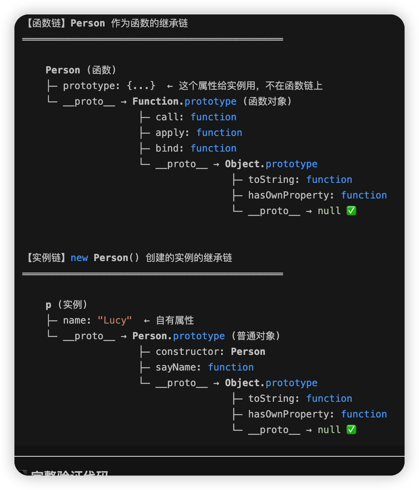

#  typeof&& instanceof


typeof主要识别基于类型和函数， instanceof识别引用类型（泛指对象）的具体类型


## 1- typeof：判断「基本数据类型」+ 识别函数（简单粗暴）

### 核心作用

专门用来快速判断**基本数据类型**，也能识别「函数」（引用类型里的特例），返回一个**字符串类型的类型名**。

```js
// 语法
typeof 变量/值;

```

案例
```
// 1. 基本数据类型判断
typeof 18;        // "number"
typeof 'Person1'; // "string"
typeof true;      // "boolean"
typeof undefined; // "undefined"
typeof Symbol();  // "symbol"
typeof 123n;      // "bigint"
typeof null;      // "object" ❌ 历史bug（记住即可，null不是对象）

// 2. 引用类型判断（局限性：只能识别函数，其他引用类型都返回"object"）
typeof { name: 'Person1' }; // "object"（无法区分普通对象/数组/日期）
typeof [];                  // "object"（数组也返回object）
typeof people;              // "object"（你之前的people数组，返回object）
typeof function() {};       // "function" ✅ 唯一能精准识别的引用类型
typeof people[0].sayHi;     // "function"（你之前的sayHi函数，返回function）

```


## 2- instanceof：判断「引用数据类型的具体类型」（查原型链）
能精准区分**具体的引用类型**（数组 / 对象 / 函数 / 日期等）；
instanceof Object 一般没错 函数也符合 数组也符合， 函数 数组都是Object的子类

案例
```js

// 1. 引用类型判断（精准区分具体类型）
const people = [];
people instanceof Array;    // true ✅ 能判断是数组（typeof只能返回object）
people instanceof Object;   // true ✅ 数组也是Object的子类（原型链继承）

const obj = { name: 'Person1' };
obj instanceof Object;      // true ✅ 普通对象
obj instanceof Array;       // false ❌ 不是数组

const sayHi = function() {};
sayHi instanceof Function;  // true ✅ 函数是Function的实例
sayHi instanceof Object;    // true ✅ 函数也是Object的子类

// 2. 基本数据类型判断（局限性：完全无效）
18 instanceof Number;       // false ❌ 基本类型的数字不是Number实例
'Person1' instanceof String;// false ❌ 同理

```

### 关键特点

- 优点：能精准区分**具体的引用类型**（数组 / 对象 / 函数 / 日期等）；
- 缺点：不能判断基本数据类型；原型链可被修改，可能导致结果不准确；
- 注意：所有引用类型都是 `Object` 的实例（所以 `xxx instanceof Object` 大概率返回 true）。


# 验证 `Person.prototype ≠ Function.prototype`

```js

function Person(name) {
  this.name = name;
}

Person.prototype.sayName = function() {
  console.log(this.name);
};

let p = new Person("Lucy");

// ========== 验证 Person.prototype ≠ Function.prototype ==========

console.log("=== 它们完全不同 ===");
console.log(Person.prototype === Function.prototype);  // false

console.log("\n=== Person.prototype 的身份 ===");
console.log(typeof Person.prototype);  // "object"（普通对象）
console.log(Person.prototype.__proto__ === Object.prototype);  // true

console.log("\n=== Function.prototype 的身份 ===");
console.log(typeof Function.prototype);  // "function"（函数对象！）
console.log(Function.prototype.__proto__ === Object.prototype);  // true

// ========== Person 的双重身份 ==========

console.log("\n=== Person 作为函数 ===");
console.log(Person.__proto__ === Function.prototype);  // true
console.log(Person.call);  // 可以用 call（从 Function.prototype 继承）

console.log("\n=== Person 作为构造函数 ===");
console.log(p.__proto__ === Person.prototype);  // true
console.log(p.sayName);  // 可以用 sayName（从 Person.prototype 继承）

// ========== 验证方法来源 ==========

console.log("\n=== 实例 p 的方法来源 ===");
console.log(p.sayName);  // 来自 Person.prototype ✅
console.log(p.call);  // undefined（实例没有 call 方法）❌

console.log("\n=== 函数 Person 的方法来源 ===");
console.log(Person.call);  // 来自 Function.prototype ✅
console.log(Person.sayName);  // undefined（函数没有 sayName 方法）❌


```


拆解 原型链

链条1
```
p (实例)
  └─ __proto__ → Person.prototype
                  └─ __proto__ → Object.prototype
                                  └─ __proto__ → null ✅


```

Person 的两条原型链（函数链 + 实例链）

链条2-1
```
Person (函数)
  └─ __proto__ → Function.prototype
                  └─ __proto__ → Object.prototype
                                  └─ __proto__ → null ✅

```

链条2-2
```
Person.prototype (对象)
  └─ __proto__ → Object.prototype
                  └─ __proto__ → null ✅

```




## `Function.prototype 是唯一特殊的 prototype`

```
// 只有 Function.prototype 是函数
typeof Function.prototype === "function"  // ✅ true

// 其他所有 prototype 都是对象
typeof Object.prototype === "object"  // true
typeof Array.prototype === "object"  // true
typeof Date.prototype === "object"  // true

```


# 数组

```
┌─────────────────────────────────────────────────────────────────────┐
│                    JavaScript 原型链全景图                            │
│                                                                       │
│  核心概念：                                                            │
│  - 构造函数（Function）有两个关键属性：                                 │
│    1. __proto__  → 指向 Function.prototype（函数自己的继承）           │
│    2. .prototype → 指向一个对象（给实例继承用的）                        │
└─────────────────────────────────────────────────────────────────────┘

```

```

┌─────────────────────────────────────────────────────────────────────┐
│  第1部分：Array 构造函数的原型链（Array 作为函数自己的链）              │
└─────────────────────────────────────────────────────────────────────┘

    Array (构造函数)
    ├─ 类型: function
    ├─ .prototype ────────────────┐  （这个属性给实例用，不在这条链上）
    │                             │
    └─ .__proto__ ────────────────┼───────> Function.prototype (函数对象)
                                  │         ├─ call: function
                                  │         ├─ apply: function
                                  │         ├─ bind: function
                                  │         └─ .__proto__ ───> Object.prototype
                                  │                            └─ .__proto__ ─> null
                                  │
                                  │
┌─────────────────────────────────▼───────────────────────────────────┐
│  第2部分：Array.prototype（给数组实例继承的对象）                       │
└─────────────────────────────────────────────────────────────────────┘
                                  │
                                  ▼
    Array.prototype (普通对象) ◄── 这就是 Array.prototype！
    ├─ 类型: object
    ├─ constructor: Array
    ├─ push: function
    ├─ pop: function
    ├─ map: function
    ├─ filter: function
    ├─ forEach: function
    ├─ ... (所有数组方法)
    │
    └─ .__proto__ ───────────────> Object.prototype (所有对象的祖先)
                                   ├─ toString: function
                                   ├─ valueOf: function
                                   ├─ hasOwnProperty: function
                                   ├─ isPrototypeOf: function
                                   │
                                   └─ .__proto__ ───> null ✅ 终点！
```

```

┌─────────────────────────────────────────────────────────────────────┐
│  第3部分：数组实例的原型链                                             │
└─────────────────────────────────────────────────────────────────────┘

    let arr = [1, 2, 3];

    arr (数组实例)
    ├─ 0: 1
    ├─ 1: 2
    ├─ 2: 3
    ├─ length: 3
    │
    └─ .__proto__ ───────────────> Array.prototype (上面的那个对象！)
                                   │
                                   └─ .__proto__ ───> Object.prototype
                                                      │
                                                      └─ .__proto__ ─> null

```


实例-继承对象-构造函数


# 构造函数的类型
```
Object.prototype 是普通对象 ✅
Array.prototype 是普通对象 ✅
Person.prototype 是普通对象 ✅

唯一例外：
Function.prototype 是函数（不是普通对象）❌

```

误区
虽然都是普通对象但内存地址不同
简单说是有级别的


```js

console.log(Array.prototype);  
// 输出：[] （一个空数组对象）

console.log(typeof Array.prototype);  
// "object"（它是对象！）

// Array.prototype 不等于 Object.prototype！ 他们都是普通对象但是内存地址不同
console.log(Array.prototype === Object.prototype);  
// false（它们是两个不同的对象！）

// 但是 Array.prototype 的 __proto__ 是 Object.prototype
console.log(Array.prototype.__proto__ === Object.prototype);  
// true（这是关键！）

```
