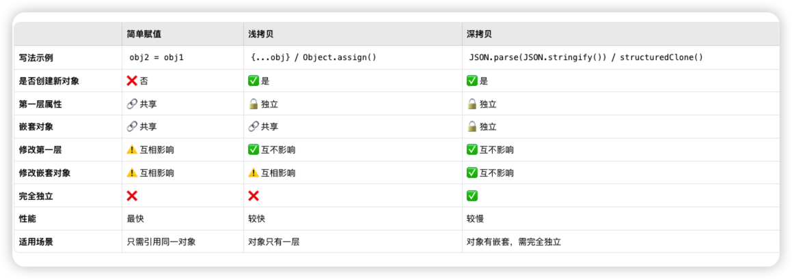
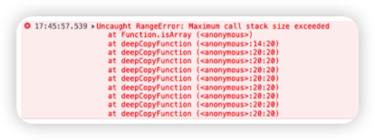

深拷贝和浅拷贝都是针对数据类型object而言，因为对象是引用类型，如果要拷贝一个副本，副本中对象更改后，不影响到原对象（或修改原对象不影响副本）


浅拷贝：复制第一层，深层仍是引用
深拷贝：递归复制所有层，完全独立


## 数组解构的内存模型

```
useState函数返回的是一个数组
┌──────────────────────────────────────────────────────────────────┐
│                   数组解构的位置对应关系                          │
├──────────────────────────────────────────────────────────────────┤
│                                                                  │
│   const [user, setUser] = useState(...)                          │
│                                                                  │
│   左边（解构模式）              右边（返回的数组）                │
│   ━━━━━━━━━━━━━━            ━━━━━━━━━━━━━━━━━                 │
│                                                                  │
│   ┌─────────────┐              ┌─────────────────────┐           │
│   │ 位置0  位置1 │              │ 下标0     下标1      │           │
│   │  ↓      ↓   │              │  ↓          ↓       │           │
│   │ user  setUser│     =       │ { name... } function │           │
│   └─────────────┘              └─────────────────────┘           │
│        ↓       ↓                     ↓          ↓               │
│        └───────┼──────按位置匹配────┘          │               │
│                └──────────────��─────────────────┘               │
│                                                                  │
│   对应关系：                                                      │
│   • user (左边位置0) = 数组[0] (右边下标0)                        │
│   • setUser (左边位置1) = 数组[1] (右边下标1)                     │
│                                                                  │
└──────────────────────────────────────────────────────────────────
```


```
内存视角看 对应关系
```
```
┌──────────────────────────────────────────────────────────────────┐
│            从内存角度理解对应关系                                 │
├──────────────────────────────────────────────────────────────────┤
│                                                                  │
│   步骤1: useState 执行后，返回数组                                │
│                                                                  │
│   堆内存                                                         │
│   ┌─────────────────────────────┐                                │
│   │ 0x100: [                    │ ← useState 返回的数组          │
│   │   0x001,  // 下标0          │                                │
│   │   0x002   // 下标1          │                                │
│   │ ]                           │                                │
│   └─────────────────────────────┘                                │
│           ↓           ↓                                          │
│           │           │                                          │
│   ┌───────┘           └────────┐                                 │
│   ↓                            ↓                                 │
│   0x001: { name: 'Alice' }    0x002: function setState()         │
│                                                                  │
│   ═════════════════════════════════════════════════════════════ │
│                                                                  │
│   步骤2: 解构赋值，按位置取值                                     │
│                                                                  │
│   栈内存                                                         │
│   ┌──────────────────┐                                           │
│   │ user   │ 0x001 ──────────→ { name: 'Alice' }                │
│   │        │   ▲     │      取自数组[0]                          │
│   ├────────┼───┼─────┤                                           │
│   │        │   │     │                                           │
│   │ setUser│ 0x002 ──────────→ function setState()              │
│   │        │   ▲     │      取自数组[1]                          │
│   └────────┼───┼─────┘                                           │
│            │   │                                                 │
│          按位置对应                                               │
│                                                                  │
└──────────────────────────────────────────────────────────────────┘
```


## 浅拷贝

**只复制第一层**：创建新对象，把第一层属性值"原样复制"过去

浅拷贝会产生新的对象，保持原对象与副本对象各自独立，但仅限于对象的第一层是原始值的情况，对象既有原始值又有引用值这种嵌套情况出现就会出现 既有独立内容又有共享内容

### 简单赋值
直接通过变量名赋值
业界有争议 严格来讲不算浅拷贝 纯共享

扩展运算符-浅拷贝


```js
// 案例1- 简单赋值

// 直接通过变量名直接赋值

let obj1 = { name: "张三" };

let obj2 = obj1; // 这不是拷贝！

  

// 案例2-扩展运算符赋值

let obj3 = { name: "张三" };

let obj4= { ...obj3 }; // 浅拷贝
```
测试效果
```js
obj4.name = "李四";
console.log(obj3.name);  // "张三" ← 没变！独立的
console.log(obj4.name);  // "李四"

console.log(obj3 === obj4);  // false ← 两个不同的对象

```


```

【直接赋值】 let obj2 = obj1

栈内存                    堆内存
┌──────┐                 
│ obj1 │─────┐           ┌──────────────┐
└──────┘     ├──────────▶│ name: "张三" │  ← 只有一个！
┌──────┐     │           └──────────────┘
│ obj2 │─────┘           
└──────┘                 


【展开运算符】 let obj4 = { ...obj3 }

栈内存                    堆内存
┌──────┐                 ┌──────────────┐
│ obj3 │────────────────▶│ name: "张三" │  ← 对象 3
└──────┘                 └──────────────┘

┌──────┐                 ┌──────────────┐
│ obj4 │────────────────▶│ name: "张三" │  ← 对象 4（新的！）
└──────┘                 └──────────────┘

```


### 什么情况不建议使用浅拷贝
当赋值的对象是嵌套对象 包含原始值和 引用值

```js
let original = {
    a: 1,           // 值类型
    b: { c: 2 }     // 引用类型（嵌套对象）
};

let shallow = { ...original };  // 浅拷贝


```
测试效果

```js
修改前:
═══════
original.a = 1        shallow.a = 1
original.b.c = 2      shallow.b.c = 2


修改 shallow.a = 100 (值类型):
════════════════════════════════
original.a = 1   ✅ 不受影响（各自独立）
shallow.a = 100


修改 shallow.b.c = 999 (嵌套对象):
════════════════════════════════════
original.b.c = 999  ❌ 被影响了！
shallow.b.c = 999      （因为共享同一个对象）

```


拆解内存模型
创建了新的对象，但是又不完全独立 第一层原始值独立式正常的，但是嵌套的 引用值共享了内存地址

```
                    浅拷贝过程
                    ═════════

  original                              shallow (新建的对象)
  ────────                              ──────────────────
      │                                       │
      ▼                                       ▼
  ┌────────────┐                         ┌────────────┐
  │ a: 1       │  ── 复制值 1 ──────────→ │ a: 1       │  ✅ 独立
  │            │                         │            │
  │ b: 0x200   │  ── 复制地址 0x200 ────→ │ b: 0x200   │  ❌ 共享
  └────────────┘                         └────────────┘
                     │                         │
                     │                         │
                     └──────────┬──────────────┘
                                │
                                ▼
                         ┌──────────┐
                         │  c: 2    │  ← 只有一份！两边共享
                         └──────────┘

```


## 深拷贝

概述
**递归复制所有层级**：遇到嵌套对象，继续往下拷贝，直到全是值类型
深拷贝可以实现原对象和副本对象各自保持完全独立 没有共享数据

案例1
```js
let original = {
    a: 1,
    b: { c: 2 }
};

let deep = JSON.parse(JSON.stringify(original));  // 深拷贝


```

测试效果
```
修改 deep.b.c = 999:
════════════════════

original.b.c = 2    ✅ 完全不受影响
deep.b.c = 999      ✅ 只改了自己的副本


```

深拷贝拆解

```
                    深拷贝过程
                    ═════════

  original                              deep (完全独立的新对象)
  ────────                              ────────────────────
      │                                       │
      ▼                                       ▼
  ┌────────────┐                         ┌────────────┐
  │ a: 1       │  ── 复制值 1 ──────────→ │ a: 1       │
  │            │                         │            │
  │ b: 0x200   │                         │ b: 0x300   │  ← 新地址！
  └────────────┘                         └────────────┘
        │                                       │
        ▼                                       ▼
  ┌──────────┐                           ┌──────────┐
  │  c: 2    │   ── 递归复制 ──────────→  │  c: 2    │
  └──────────┘                           └──────────┘
  (地址 0x200)                           (地址 0x300)
  
  两份完全独立的数据！


```


浅拷贝 深拷贝对比

```
┌─────────────────────────────────────────────────────────────────┐
│                         原始对象                                 │
│                                                                 │
│                    { a: 1, b: { c: 2 } }                        │
│                                                                 │
└─────────────────────────────────────────────────────────────────┘
                    │                       │
          ┌────────┴────────┐     ┌────────┴────────┐
          │    浅拷贝        │     │    深拷贝        │
          │  (只复制一层)    │     │  (递归全复制)    │
          └────────┬────────┘     └────────┬────────┘
                   │                       │
                   ▼                       ▼
┌─────────────────────────────┐ ┌─────────────────────────────┐
│                             │ │                             │
│  original      shallow      │ │  original      deep         │
│     │             │         │ │     │           │           │
│     ▼             ▼         │ │     ▼           ▼           │
│  ┌─────┐      ┌─────┐       │ │  ┌─────┐     ┌─────┐        │
│  │ a:1 │      │ a:1 │ 独立  │ │  │ a:1 │     │ a:1 │  独立  │
│  │ b:→ │      │ b:→ │       │ │  │ b:→ │     │ b:→ │        │
│  └──┬──┘      └──┬──┘       │ │  └──┬──┘     └──┬──┘        │
│     │            │          │ │     │           │           │
│     └─────┬──────┘          │ │     ▼           ▼           │
│           ▼                 │ │  ┌─────┐     ┌─────┐        │
│       ┌───────┐             │ │  │ c:2 │     │ c:2 │  独立  │
│       │ c: 2  │  共享！     │ │  └─────┘     └─────┘        │
│       └───────┘             │ │                             │
│                             │ │                             │
│  ❌ 改b.c会互相影响         │ │  ✅ 完全独立                 │
│                             │ │                             │
└─────────────────────────────┘ └─────────────────────────────┘

```


## 一张表总结




## 第三方库 lodash、rfdc

深拷贝可以使用lodash库，使用方法如下

```js
import _ from "lodash" const nestedArray = [[1], [2], [3]]; 
const shallowCopyWithLodashClone = _.clone(nestedArray); // 浅拷贝
const deepCopyWithLodashClone = _.cloneDeep(nestedArray); // 深拷贝
```

rfdc库也可以实现深拷贝，它的优点是速度快

```js
const clone = require('rfdc')() // 
clone({a: 37, b: {c: 3700}}) // {a: 37, b: {c: 3700}}

```


## 自定义函数实现深拷贝

### 简单版：
处理对象和数组
实现深拷贝的关键就是使用递归复制原对象（或数组）的键和值， 判断嵌套的值是否是引用类型
在下面代码里对应对象或数组， 如果是引用类型则继续递归，直到值是原始值为止。

```js
// 自定义函数实现深拷贝

// 处理对象和数组

  

const deepCopy = (obj) => {

// 如果不是对象或者为null，直接返回 逻辑或找真值

if (typeof obj !== "object" || obj === null ) {

return obj

}

// 创建一个新对象或数组

const newObj = Array.isArray(obj) ? [] : {}

  

Object.keys(obj).forEach((key) => {

newObj[key] = deepCopy(obj[key])

});

return newObj;

};

  

// 测试对象和数组的深拷贝

const nestedArray = [[1], [2], [3]]

const nestArrayCopy = deepCopy(nestedArray); // 深拷贝

console.log(nestedArray === nestArrayCopy); // false

  

// 修改原对象

nestedArray[0][0] = 4; // [[4], [2], [3]]

console.log(nestArrayCopy); // 使用深拷贝后副本对象完全独立 不受影响[[1], [2], [3]]

```


### 进阶版：
处理循环引用

 简单版只处理了普通的数组和对象， 然而遇到循环引用，上面的代码就不能得到正确结果了

```js
const nestedObject = {
     name: 'lucy'
}

```
如果使用简单版深拷贝 会报错

解决循环引用导致的栈内存溢出，我们只需要使用WeakMap记录已经复制过的对象，如下面代码中的cache，如果已经复制过该对象，则直接返回缓存中的对象，避免了无限递归的问题。
```js
// 处理循环引用
// 创建WeakMap实例 键必须是obj 可以GC
  

const deepCopy = (obj, cache = new WeakMap()) => {

// 如果不是对象或者为 null，直接返回

if (typeof obj !== "object" || obj === null) {

return obj;

}

  

// 如果已经复制过该对象，则直接返回

if (cache.has(obj)) {

return cache.get(obj);

}

  

// 创建一个新对象或数组

const newObj = Array.isArray(obj) ? [] : {};

  

// 将新对象放入 cache 中

cache.set(obj, newObj);

  

// 处理循环引用的情况

Object.keys(obj).forEach((key) => {

newObj[key] = deepCopy(obj[key], cache);

});

  

return newObj;

};

  

// 测试有循环引用的深拷贝：

const nestedObject = {

name: 'Lily'

}

nestedObject.nestedObject = nestedObject;


  

// ==================== 完善的测试部分 ====================

// 测试1：验证「循环引用对象」的深拷贝（原示例补充执行）

console.log("===== 测试1：循环引用对象深拷贝 =====");

// 执行深拷贝

const clonedNestedObj = deepCopy(nestedObject);

  

// 验证结果

console.log("原对象：", nestedObject);

console.log("拷贝后的对象：", clonedNestedObj);

// 核心验证：拷贝后的对象和原对象引用不同，但内容一致，且不报错（解决循环引用）

console.log("拷贝对象与原对象是否为同一引用？", clonedNestedObj === nestedObject); // 预期：false

console.log("拷贝对象的循环引用属性是否有效？", clonedNestedObj.nestedObject === clonedNestedObj); // 预期：true（自身引用自身）

```


最终版：
处理特殊对象：Date 和 RegExp

```js
// 处理特殊对象 Date 和 RegExp


  

// ==================== 测试代码 ====================

console.log("===== 测试1：循环引用对象深拷贝 =====");

// 制造循环引用的对象

const loopObj = {

name: "张三",

age: 25

};

loopObj.self = loopObj; // 自身引用，形成循环

  

const clonedLoopObj = deepCopy(loopObj);

// 验证：拷贝后引用独立，且循环引用不报错

console.log("原对象与拷贝对象是否为同一引用？", clonedLoopObj === loopObj); // 预期：false

console.log("拷贝对象的循环引用是否有效？", clonedLoopObj.self === clonedLoopObj); // 预期：true

  

console.log("\n===== 测试2：Date对象深拷贝 =====");

const originalDate = new Date("2026-01-01");

const clonedDate = deepCopy(originalDate);

// 验证：Date类型保留，且引用独立

console.log("拷贝后是否为Date实例？", clonedDate instanceof Date); // 预期：true

console.log("原Date与拷贝Date值是否相同？", originalDate.getTime() === clonedDate.getTime()); // 预期：true

console.log("原Date与拷贝Date是否为同一引用？", originalDate === clonedDate); // 预期：false

  

console.log("\n===== 测试3：RegExp对象深拷贝 =====");

const originalReg = /javascript/gi; // 带修饰符g（全局）、i（忽略大小写）

const clonedReg = deepCopy(originalReg);

// 验证：正则source和flags都保留，引用独立

console.log("拷贝后正则source是否一致？", clonedReg.source === originalReg.source); // 预期：true

console.log("拷贝后正则flags是否一致？", clonedReg.flags === originalReg.flags); // 预期：true

console.log("原正则与拷贝正则是否为同一引用？", originalReg === clonedReg); // 预期：false

  

console.log("\n===== 测试4：嵌套对象/数组深拷贝 =====");

const originalData = {

user: "李四",

birthday: new Date("1990-05-10"),

hobby: ["读书", /^book\d+$/g, { level: "资深" }], // 嵌套数组+正则+对象

score: null // 测试null值

};

const clonedData = deepCopy(originalData);

  

// 修改拷贝对象的嵌套属性，验证不影响原对象

clonedData.hobby[0] = "运动";

clonedData.hobby[2].level = "入门";

clonedData.birthday.setFullYear(2000);

  

// 验证原对象属性未被修改

console.log("原对象hobby[0]是否未变？", originalData.hobby[0] === "读书"); // 预期：true

console.log("原对象嵌套对象level是否未变？", originalData.hobby[2].level === "资深"); // 预期：true

console.log("原对象Date是否未被修改？", originalData.birthday.getFullYear() === 1990); // 预期：true

```