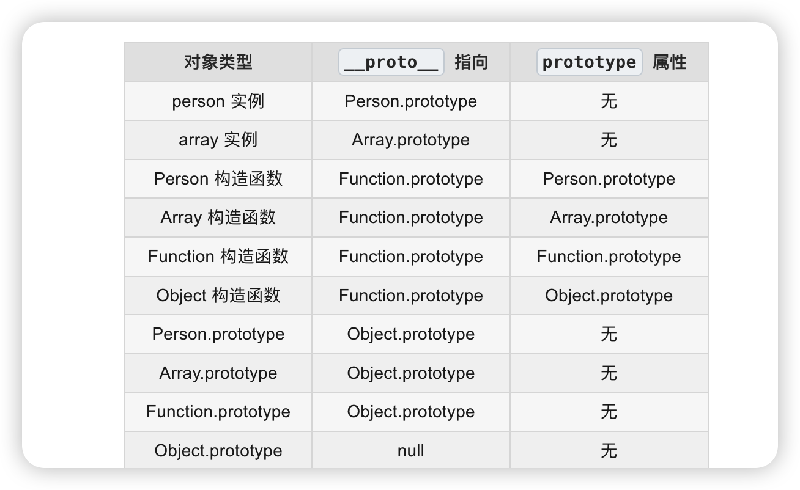

原型链经典图

```
┌──────────────────────────────────────────────────────────────┐
│                         实例对象                              │
├──────────────────────────────────────────────────────────────┤
│  person          array           func           obj          │
│    ↓               ↓               ↓              ↓          │
└────┼───────────────┼───────────────┼──────────────┼──────────┘
     │               │               │              │
     │__proto__      │__proto__      │__proto__     │__proto__
     │               │               │              │
┌────┼───────────────┼───────────────┼──────────────┼──────────┐
│    ↓               ↓               ↓              ↓          │
│ Person.prototype  Array.prototype  Function.prototype  Object.prototype │
│                                                               │
│  constructor      constructor      constructor    constructor│
│     ↓                ↓                ↓              ↓        │
└─────┼────────────────┼────────────────┼──────────────┼────────┘
      │                │                │              │
      │                │                │              │
┌─────┼────────────────┼────────────────┼──────────────┼────────┐
│     ↓                ↓                ↓              ↓        │
│  Person            Array            Function       Object     │
│     │                │                │              │        │
│     │__proto__       │__proto__       │__proto__     │__proto__│
│     └────────────────┴────────────────┴──────────────┘        │
│                            ↓                                  │
│                    Function.prototype                         │
│                            ↓                                  │
│                      Object.prototype                         │
│                            ↓                                  │
│                          null                                 │
└───────────────────────────────────────────────────────────────┘

```


案例

```js

function Person(name) {
  this.name = name;
}

let person = new Person('Alice');
let array = [1, 2, 3];
let func = function() {};
let obj = {};

// 实例 → 原型
person.__proto__ === Person.prototype           // true
array.__proto__ === Array.prototype             // true
func.__proto__ === Function.prototype           // true
obj.__proto__ === Object.prototype              // true

// 原型 → Object.prototype
Person.prototype.__proto__ === Object.prototype // true
Array.prototype.__proto__ === Object.prototype  // true
Function.prototype.__proto__ === Object.prototype // true

// Object.prototype → null
Object.prototype.__proto__ === null             // true

// 构造函数 → Function.prototype
Person.__proto__ === Function.prototype         // true
Array.__proto__ === Function.prototype          // true
Object.__proto__ === Function.prototype         // true
Function.__proto__ === Function.prototype       // true

// prototype.constructor 指回构造函数
Person.prototype.constructor === Person         // true
Array.prototype.constructor === Array           // true
Function.prototype.constructor === Function     // true
Object.prototype.constructor === Object         // true

```


拆解案例

一层一层往上爬 爬到 Object.prototype就基本封顶 顶上是虚无

```

alice
  .__proto__ → Person.prototype
                 .__proto__ → Object.prototype
                                .__proto__ → null

```





##  `prototype` && `__proto__` 关系


只有函数有 prototype属性
所有对象包含函数都有__proto__属性

案例
```js
function Person() {}
const alice = new Person();

// alice 通过 __proto__ 向上找
alice.__proto__  // Person.prototype

// Person.prototype 只是被指向的对象
Person.prototype  // { constructor: Person }

```


拆解案例
```
function Person() {}
const alice = new Person();

Person.prototype  ← 这是模板对象
     ↑
     | 被指向
     |
alice.__proto__  ← 这是查找链

```

记忆口诀

```
__proto__ 是箭头（向上找）
.prototype 是靶子（被指向）

```

误区
```js
function Person() {}
const alice = new Person();

alice.__proto__.constructor === Person  // true 函数本身


```
constructor不是向下找 也是访问属性 返回对象本身
```
alice.__proto__              // 原型链查找 ↑
alice.__proto__.constructor  // 属性访问 →
alice.name                   // 属性访问 →


```