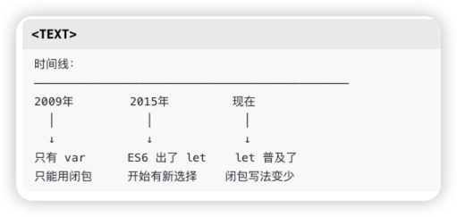
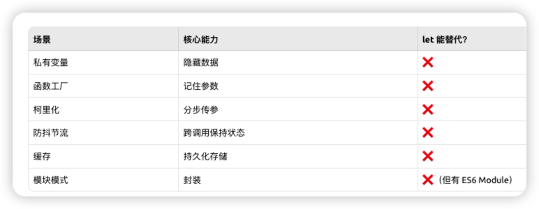
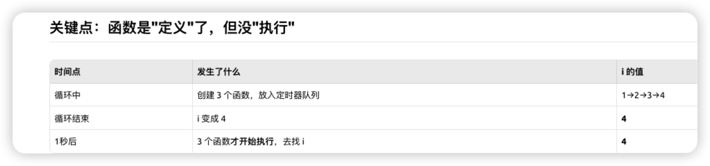
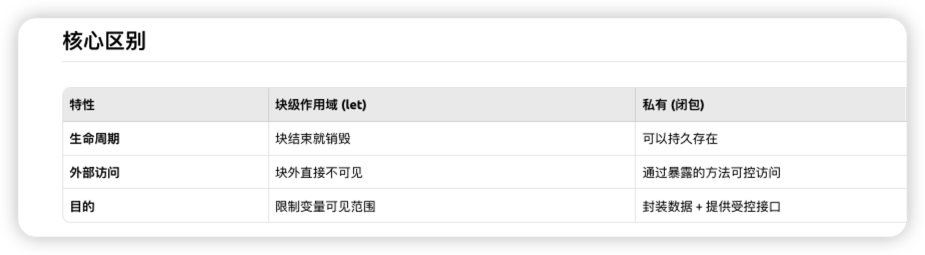
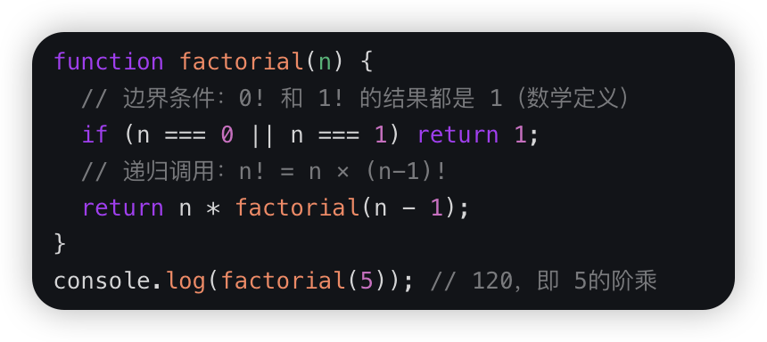

闭包让开发者可以从内部函数访问外部函数的作用域
内部函数引用了外部函数的变量 方法
**闭包 = 外层函数 + 自由变量 + 内层函数持有引用**



## 函数是一等公民的三个基本事实


### 事实1： 函数可以嵌套

```
function 外() {
    function 内() { }
}

```

**内层函数**


**内层函数 = 函数里面定义的函数**

不管它是否被 return，只要**定义位置**在另一个函数内部


误区

```js
if (true) {
    function foo() {}  // 这不是"内层函数"
}                      // 因为 if 不是函数


```

```
问自己：这个函数写在哪？

写在另一个 function 的 { } 里 → 内层函数 ✅
写在 if/for/对象 的 { } 里    → 不算 ❌
写在最外层                    → 外层函数


```


事实2：内部函数可以访问外部变量
真正干活的可以访问闭包函数作用域的私有变量
```
function 外() {
    let a = 1;
    function 内() {
        console.log(a);  // ✅ 能访问
    }
}

```


事实3: 函数可以被返回

```
function 外() {
    function 内() { }
    return 内;  // ✅ 函数当返回值
}

```


组合三个基本事实

```
function 外() {
    let a = 1;
    function 内() {
        console.log(a);
    }
    return 内;
}

const fn = 外();  // 外() 执行完毕
fn();             // ❓ 此时 a 还在吗？

```


**关键问题**：

- 正常情况：函数执行完 → 局部变量销毁
- 但 `内` 还在引用 `a` → 怎么办？

```
外() 执行完毕
    ↓
正常应该销毁 a
    ↓
但 内() 还引用着 a
    ↓
所以 a 被保留下来，跟着 内() 走
    ↓
这个「函数 + 它引用的外部变量」的组合 = 闭包

```


闭包使用场景



## 案例1-经典循环案例

用var声明变量
```
for (var i = 1; i <= 3; i++) {
    setTimeout(function() {
        console.log(i);
    }, 1000);
}
// 输出：4, 4, 4

```

拆解执行顺序
```
// 第1次循环 (i=1)
setTimeout(function() { console.log(i); }, 1000);  // 函数1

// 第2次循环 (i=2)
setTimeout(function() { console.log(i); }, 1000);  // 函数2

// 第3次循环 (i=3)
setTimeout(function() { console.log(i); }, 1000);  // 函数3

// 循环结束后 i=4
// 循环结束 函数才开始执行 次数var修饰是全局作用于i共享，函数是定义了但没执行


```




### 解决方案1-用let声明变量 块级作用域


```
for (let i = 1; i <= 3; i++) {
    setTimeout(function() {
        console.log(i);
    }, 1000);
}
// 输出: 1, 2, 3


```

```
        var                              let
        ───                              ───
        
时间0ms  ┌─ 循环开始 ─┐                  ┌─ 循环开始 ─┐
        │ i=1 创建函数1│                  │ i=1 创建函数1（绑定i=1）
        │ i=2 创建函数2│                  │ i=2 创建函数2（绑定i=2）
        │ i=3 创建函数3│                  │ i=3 创建函数3（绑定i=3）
        │ i=4 循环结束 │                  │ 循环结束
        └─────────────┘                  └─────────────┘
        
时间1000ms  函数执行                       函数执行
           │                              │
           ↓                              ↓
        找 i → 4                       各自找自己的 i
        找 i → 4                       函数1 → 1
        找 i → 4                       函数2 → 2
                                       函数3 → 3


```


### 解决方案2-闭包 创建新作用域保持变量独立

```
for (var i = 1; i <= 3; i++) {
    (function(j) {  // 创建新作用域，j 是独立的
        setTimeout(function() {
            console.log(j);
        }, 1000);
    })(i);
}
// 输出：1, 2, 3


```


## 闭包的核心作用

私有变量

```js
function createWallet() {
    let money = 100;  // 外部无法直接访问
    
    return {
        spend: function(amount) {
            if (amount <= money) {
                money -= amount;
                return true;
            }
            return false;
        },
        check: function() {
            return money;
        }
    };
}

const wallet = createWallet();
wallet.check();     // 100
wallet.spend(30);   // true
wallet.check();     // 70
wallet.money;       // undefined ← 访问不到！

```

```
┌─────────────────────────────┐
│  createWallet 作用域         │
│                             │
│   money = 70  🔒 私有的      │
│       ↑                     │
│   ┌───┴───┐                 │
│   │ spend │ ← 能访问 money   │
│   │ check │ ← 能访问 money   │
│   └───────┘                 │
└─────────────────────────────┘
        ↓ 返回
    外部只能用 spend/check
    不能直接改 money
    
    
let 替代不了：let 只是块作用域，无法实现"私有"

```


 ### 私有变量（闭包） 跟块级作用域核心区别

块级作用域
```js
{
  let money = 70;
  console.log(money); // ✅ 70
}
console.log(money); // ❌ 报错，money 不存在了
// 块结束，money 就"死了"，谁也用不了

```

私有（闭包）
```js
// 取钱消费这个案例就很经典
function createWallet() {
  let money = 70;  // 私有变量
  
  return {
    spend(n) { money -= n; },
    check() { return money; }
  };
}

const wallet = createWallet();
wallet.check();    // ✅ 70 —— 通过方法访问
wallet.money;      // ❌ undefined
// money 还"活着"，但只能通过 spend/check 操作


```
**块级作用域** = 变量的"寿命"短，块结束就没了

**私有** = 变量还活着，但外部**只能通过你提供的方法**来操作


## 函数工厂


```
外层函数：接收"配置"（x=几倍）
内层函数：接收"数据"（y=要乘的数）

调用外层 → 拿到内层
调用内层 → 拿到结果

function 工厂(配置参数) {
  return function(原料) {
    // 用 配置参数 + 原料 生产结果
    return 结果;
  };
}

const 机器A = 工厂(配置A);
const 机器B = 工厂(配置B);

机器A(原料1);  // 用配置A加工原料1
机器B(原料2);  // 用配置B加工原料2


```

案例：
```js
// 生成不同折扣计算器
function createDiscount(rate) {
  return function(price) {
    return price * rate;
  };
}

const 八折 = createDiscount(0.8);
const 半价 = createDiscount(0.5);

八折(100);  // 80
半价(100);  // 50

```


闭包存在的必要性

函数工厂为例

需求场景是一套配置 用变量足够
```
// 方案A：直接用变量
const taxRate = 0.08;
function calcTax(price) {
  return price * (1 + taxRate);
}

calcTax(100);  // 108

```


需要多套配置同时存在时候

变量方式的问题
```js
let taxRate = 0.08;

function calcTax(price) {
  return price * (1 + taxRate);
}

// 美国订单
taxRate = 0.08;
const 美国价 = calcTax(100);  // 108

// 欧洲订单
taxRate = 0.20;
const 欧洲价 = calcTax(100);  // 120

// ⚠️ 问题来了！之前的美国税率被覆盖了
// 如果再算美国订单，得重新设置 taxRate

```


闭包方式

```js
function createTaxCalc(taxRate) {
  return function(price) {
    return price * (1 + taxRate);
  };
}

const 美国税 = createTaxCalc(0.08);
const 欧洲税 = createTaxCalc(0.20);
const 日本税 = createTaxCalc(0.10);

// 三套配置同时存在，互不干扰
美国税(100);  // 108
欧洲税(100);  // 120
日本税(100);  // 110

// 随时可用，不用切换
美国税(200);  // 216

```
一句话总结

|场景|用什么|
|---|---|
|只需要**一套配置**|普通变量就够|
|需要**多套配置并存**|闭包更合适|


## 函数柯里化

**柯里化 = 把一次吃完的饭，变成一口一口吃**

案例1：
```js
// 普通写法
function add(a, b, c) {
    return a + b + c;
}
add(1, 2, 3);  // 6

// 柯里化（闭包实现）
function curriedAdd(a) {
    return function(b) {
        return function(c) {
            return a + b + c;  // 记住了 a 和 b
        };
    };
}
curriedAdd(1)(2)(3);  // 6

// 实用场景
const addTax = curriedAdd(0.1);  // 固定税率 10%
const addShipping = addTax(5);    // 固定运费 5
addShipping(100);  // 0.1 + 5 + 100 = 105.1


```
案例2：

```js
// 假设要实现：过滤 → 映射 → 排序

// ===== 工厂模式思维 =====
const createProcessor = (filterFn, mapFn, sortFn) => {
    return (data) => {
        return data.filter(filterFn).map(mapFn).sort(sortFn);
    };
};
// 问题：filterFn, mapFn, sortFn 必须同时传入
// 无法灵活组合

// ===== 柯里化思维 =====
const filter = fn => arr => arr.filter(fn);
const map = fn => arr => arr.map(fn);
const sort = fn => arr => [...arr].sort(fn);

const pipe = (...fns) => x => fns.reduce((v, f) => f(v), x);

// 可以任意组合
const process1 = pipe(filter(x => x > 0), map(x => x * 2));
const process2 = pipe(map(x => x * 2), sort((a, b) => a - b));
const process3 = pipe(filter(x => x > 0), sort((a, b) => b - a));

// 灵活度完全不同


```
工厂模式对比 柯里化


```
工厂模式
┌─────────────────────────────────────────────┐
│         createProcessor(过滤, 映射, 排序)      │
│                                             │
│    必须同时塞进去 3 个函数，缺一不可            │
│                                             │
│         📦 ← [filterFn, mapFn, sortFn]      │
│                                             │
│    想要不同组合？重新建一个工厂！               │
└─────────────────────────────────────────────┘

😫 想要 只过滤+映射？ → 不行，必须传3个
😫 想要 只映射+排序？ → 不行，必须传3个


柯理化
每个操作都是独立积木：

   ┌─────────┐    ┌─────────┐    ┌─────────┐
   │ filter  │    │   map   │    │  sort   │
   │  过滤   │    │   映射   │    │  排序   │
   └─────────┘    └─────────┘    └─────────┘
        🟦            🟨             🟩


想怎么拼就怎么拼：

组合1:  🟦 → 🟨           过滤 → 映射
组合2:  🟨 → 🟩           映射 → 排序  
组合3:  🟦 → 🟩           过滤 → 排序
组合4:  🟦 → 🟨 → 🟩      全部都要
组合5:  🟩 → 🟦 → 🟨      换个顺序也行！


```

| 模式  | 比喻        | 灵活度   |
| --- | --------- | ----- |
| 工厂  | 套餐（必须一起买） | ⭐     |
| 柯里化 | 单点（随意搭配）  | ⭐⭐⭐⭐⭐ |


## 缓存变量的值


缓存 = 私有变量 + 函数工厂


私有变量 + 函数工厂 = 基础积木

缓存(memoize)    ← 用积木搭的"常用模型"，给它起个名
防抖(debounce)   ← 用积木搭的"常用模型"，给它起个名
节流(throttle)   ← 用积木搭的"常用模型"，给它起个名
柯里化(curry)    ← 用积木搭的"常用模型"，给它起个名


只要变量在函数内部（不管是形参还是自己声明的），外部拿不到，就是私有；闭包就是让这些私有变量不销毁，还能通过返回的函数间接操作

### 案例1

```js
  

function createInc(startValue) {

let index = -1;

return (step) => {

startValue += step;

index++;

return [index, startValue];

};

}

  

const inc = createInc(5);

console.log(inc(2)); // [0, 7]

console.log(inc(2)); // [1, 9]

console.log(inc(2)); // [2, 11]

```
拆解1 
函数作用域变量
startValue也是 函数作用域的私有变量
```js
function createInc(initValue) { // 形参改个名字

let startValue = initValue; // 用let声明，把形参存进去

let index = -1;

return (step) => {

startValue += step;

index++;

return [index, startValue];

};

}

  

const inc = createInc(5);

// 外部依然访问不到 startValue/index → 还是私有

```

本质：不管是 “形参直接用” 还是 “let 声明存形参”，只要在 `createInc` 作用域内，就是私有的；闭包保护的是「整个作用域的变量」，不是某一种声明方式的变量。

**额外补充：var 声明也不会破坏私有性（只是提升规则不同），会被函数作用域限制**

就算你在 `createInc` 里用 var 声明变量，依然是私有的，外部访问不到：


### 案例2
```js
function memoize(fn) {

const cache = {}

  

return function(n) {

if(cache[n] !== undefined) {

console.log('从缓存中取')

return cache[n];

}

console.log('计算中...');

cache[n] = fn(n);

return cache[n]

}

}

const factorial = memoize(function(n) {

return n <= 1 ? 1 : n * factorial(n-1);

})

factorial(5); // 计算中... 120

factorial(5); // 从缓存取 120
```


拆解案例1

### 对象 与数组对比

| 特性          | 数组 `[]`             | 对象 `{}`  |
| ----------- | ------------------- | -------- |
| 键类型         | 只能是连续数字索引           | 任意字符串/数字 |
| 有 `.length` | ✅ 有                 | ❌ 没有     |
| 有数组方法       | ✅ `push/map/filter` | ❌ 没有     |

```js
// 数组：连续索引
const arr = [];
arr[0] = 'a';
arr[1] = 'b';
arr.length  // → 2

// 对象：随意跳跃
const obj = {};
obj[100] = 'a';
obj[999] = 'b';
obj.length  // → undefined

```


cache[n] 是什么
这是JavaScript对象的两种访问方式

```js
const cache = {};

// 方式1：点语法（属性名是固定的）
cache.name = "张三";
cache.age = 25;

// 方式2：方括号语法（属性名可以是变量）
const key = "name";
cache[key] = "张三";     // 等同于 cache.name = "张三"
cache["age"] = 25;       // 等同于 cache.age = 25


```


为什么用cache[n] 而不是cache.n ?

用变量的值作为键 而不是 变量名作为键值
```js
// 使用cache[n]
function memoize(fn) {
    const cache = {}; // 闭包对象来缓存 对比与数组区别
    return function(n) {    // n 是变量，值会变化！
        cache[n] = fn(n);   // 用 n 的值作为属性名
        return cache[n];
    };
}

const factorial = memoize(fn);

factorial(3);  // n = 3  → cache[3] = 6   → cache = { 3: 6 }
factorial(5);  // n = 5  → cache[5] = 120 → cache = { 3: 6, 5: 120 }
factorial(3);  // n = 3  → cache[3] 已存在，直接返回 6


```

如果用cache.n:
```js

cache.n = fn(n);  // ❌ 这会创建一个叫 "n" 的属性
                  // cache = { n: 6 }，永远只有一个键


```

|写法|含义|结果|
|---|---|---|
|`cache.n`|访问名为 `"n"` 的属性|`cache = { n: 值 }`|
|`cache[n]`|访问名为 **n变量的值** 的属性|`cache = { 3: 值, 5: 值, ... }`|


拆解2 

高阶函数与函数工厂
```
            高阶函数                    函数工厂
           (是什么)                    (做什么)
              │                           │
              ▼                           ▼
     ┌────────────────┐          ┌────────────────┐
     │  接收函数 或    │          │   批量生产      │
     │  返回函数       │          │   定制化函数    │
     └────────────────┘          └────────────────┘
              │                           │
              ▼                           ▼
           技术特征                     使用目的


```

1. **包含关系**：函数工厂一定是高阶函数，但高阶函数不一定是函数工厂；
2. **核心区分**：看目的 —— 如果高阶函数的核心是 “造定制化函数”，就是函数工厂；如果是其他目的（遍历、防抖、过滤），就是普通高阶函数；
3. **记忆关键点**：高阶函数是 “操作函数的函数”（收函数 / 返函数），函数工厂是 “专门造函数的高阶函数”。

只要返回函数，就是函数工厂，输入是什么不重要，关键看输出是不是新函数


拆解3
阶乘函数

- **单词根源**：`factorial` 来自数学术语，核心是 “阶乘”；而 “函数工厂” 的英文是 `function factory`，是编程里生成函数的函数，两者拼写 / 含义完全不同。
- **代码逻辑再解释**：你这段代码是计算数字的阶乘（`n!`），比如 `factorial(5)` 就是计算 `5×4×3×2×1=120`：
- 


## 防抖节流


### 案例1
```js
function debounce(fn, delay) {
    let timer = null;  // 闭包保存 timer
    
    return function(...args) {
        clearTimeout(timer);
        timer = setTimeout(() => {
            fn.apply(this, args);
        }, delay);
    };
}

// 使用
const search = debounce(function(keyword) {
    console.log('搜索:', keyword);
}, 500);

// 快速输入，只执行最后一次
search('a');
search('ab');
search('abc');  // 只有这个会执行

```


拆解1
```js
┌──────────────────────────┐
│  debounce 作用域          │
│                          │
│   timer = ... 🔒         │
│      ↑                   │
│   返回的函数能访问 timer   │
│   每次调用共享同一个 timer │
└──────────────────────────┘


```

## 模块模式
闭包模拟私有方法
私有方法可以限制对代码的访问， 而且可以用于管理全局变量命名，避免扰乱公共代码

### 案例1

```js
  

let Counter = (function() {

let privateCounter = 0;

function changeBy(val) {

privateCounter += val;

}

return {

increment: function() {

changeBy(1);

},

decrement: function() {

changeBy(-1);

},

value: function() {

return privateCounter;

}

};

})();

  

console.log(Counter.value()); // 0

Counter.increment();

Counter.increment();

console.log(Counter.value()); // 2

Counter.decrement();

console.log(Counter.value()); // 1

```

**拆解（闭包的关键痕迹）**

1. 代码里的闭包体现在：`increment/decrement/value` 这三个内部函数，**引用了外部函数里的 `changeBy` 和 `privateCounter`**；
2. 立即执行函数执行完后，`privateCounter` 没有被销毁，依然能被这三个内部函数操作 / 访问 —— 这就是闭包最核心的体现；
3. 简单记：只要「内部函数用了外部的变量，且外部函数执行完变量还在」，就是闭包。

这段代码是闭包的经典应用（模块模式），核心就是用闭包实现 “私有变量 + 状态持久化”，你盯着「内部函数引用外部变量」这个点，就能快速识别所有闭包代码～


### 案例2

```js
const Calculator = (function() {
    // 私有
    let result = 0;
    
    function validate(n) {
        return typeof n === 'number';
    }
    
    // 公开
    return {
        add: function(n) {
            if (validate(n)) result += n;
            return this;
        },
        getResult: function() {
            return result;
        }
    };
})();

Calculator.add(5).add(3).getResult();  // 8
Calculator.result;    // undefined
Calculator.validate;  // undefined


```
拆解 函数墙
墙内+return所有函数表达式具备，闭包要满足 内部函数引用外部函数作用域的变量
```
┌─────────────────────────────────┐
│  IIFE 的作用域（墙内）           │
│                                 │
│   let result = 0     🔒私有     │
│   function validate  🔒私有     │
│                                 │
│   ┌─────────────────────┐      │
│   │ return { add, get } │ ←窗口 │
│   └─────────────────────┘      │
└─────────────────────────────────┘
          ↓
    Calculator = { add, getResult }


```

### 闭包的’私有‘ 与 ’公开‘
```
return 出去的 = 公开
没 return 的 = 私有

```


|return 什么|公开了什么|私有的是什么|
|---|---|---|
|函数|一个操作能力|内部变量|
|对象|多个操作能力|内部变量和函数|
|值|值的拷贝|原始变量|
