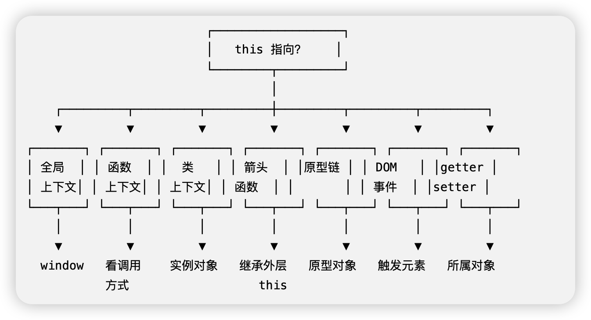
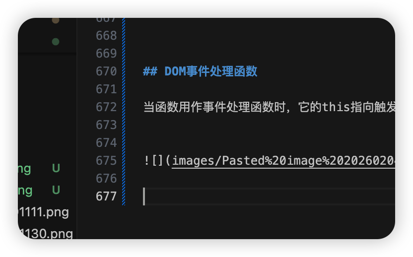

函数的调用方式决定了this的值（运行时绑定）。 this不能在执行期间被赋值，并且在每次函数调用时this的值也可能会不同。

this的指向有以下七种：
全局上下文、函数上下文、类上下文、箭头函数、原型链中的this、作为一个DOM事件处理函数
getter与setter中的this

```
┌─────────────────────────────────────────────────────────┐
│  this 的本质：谁调用，指向谁（运行时动态绑定）           │
│                                                         │
│  this ≠ 定义时确定                                      │
│  this = 调用时确定                                      │
└─────────────────────────────────────────────────────────┘

```


## 七种场景决策树





## 全局上下文

this指向全局对象


```js
// 全局上下文

// 第一步：判断运行环境，获取正确的全局对象（兼容浏览器/Node.js）

const globalObj = typeof window !== 'undefined' ? window : globalThis;

  

// 第二步：替换 window 为兼容的全局对象

console.log(this === globalObj); // 浏览器：true；Node.js：false（原因见下文）

  

// 第三步：全局变量赋值的兼容写法

globalObj.a = 37;

console.log(globalObj.a); // 浏览器/Node.js 都输出 37

  

// 补充：Node.js 全局作用域的 this 指向说明

console.log('Node.js 全局 this 指向：', this); // 输出 {}（module.exports）

console.log('Node.js 全局对象：', globalThis); // 输出 Node.js 的全局对象

```

测试代码

```
Running] node "/Users/johnpeng/career_data/code/openbook-baoyi/applet/ch05-JavaScript函数/this指向.js"

false

37

Node.js 全局 this 指向： {}

Node.js 全局对象： <ref *1> Object [global] {

global: [Circular *1],

clearImmediate: [Function: clearImmediate],

setImmediate: [Function: setImmediate] {

[Symbol(nodejs.util.promisify.custom)]: [Getter]

},

clearInterval: [Function: clearInterval],

clearTimeout: [Function: clearTimeout],

setInterval: [Function: setInterval],

setTimeout: [Function: setTimeout] {

[Symbol(nodejs.util.promisify.custom)]: [Getter]

},

queueMicrotask: [Function: queueMicrotask],

structuredClone: [Function: structuredClone],

atob: [Getter/Setter],

btoa: [Getter/Setter],

performance: [Getter/Setter],

fetch: [Function: value],

crypto: [Getter],

a: 37

}

```


- **globalThis 的作用**：ES2020 新增的标准全局对象，能自动适配浏览器（指向 window）、Node.js（指向 global）、小程序等所有 JS 环境，是跨环境开发的最佳实践。
- **Node.js 全局作用域的 this 指向**：
    
    - 在 Node.js 的顶级作用域中，`this` 并不指向全局对象（globalThis），而是指向当前模块的 `module.exports`（一个空对象），所以 `this === globalThis` 会返回 `false`；
    - 但如果在 Node.js 的 REPL 终端（直接输入 node 命令进入交互模式）中执行，`this` 会指向 globalThis，这是一个容易混淆的点。
    
- **全局变量赋值**：在浏览器中直接写 `a = 37` 等价于 `window.a = 37`；但在 Node.js 中直接写 `a = 37` 会隐式挂载到 `globalThis` 上，不过更规范的写法是显式使用 `globalThis.a = 37`。


## 函数上下文

this指向取决于函数被调用的方式：
- 作为对象的方法调用，this指向该对象
- 作为普通函数调用

```js
// 严格模式下: this 指向 undefined

function f2(){

"use strict";

return this;

}

  

f2() === undefined; // true

  

// call 方法: this 指向传入的指定对象 o

function add(c, d) {

return this.a + this.b + c + d;

}

var o = {a: 1, b: 3};

add.call(o, 5, 7); // 16

```

拆解


`add.call(o, 5, 7)` 干了两件事：
```
┌─────────────────────────────────────┐
│  add.call(o, 5, 7)                  │
│                                     │
│  = 第1步：把 this 绑定到 o          │
│  + 第2步：调用 add 函数             │
│                                     │
│  就是：指定this + 调用函数          │
└


```


## this的四种绑定方式

|绑定类型|调用方式|this 指向|记忆口诀|
|---|---|---|---|
|**默认绑定**|`fn()`|`window` / `undefined`|光秃秃调用 → 全局|
|**隐式绑定**|`obj.fn()`|`obj`|点前面是谁就是谁|
|**显式绑定**|`fn.call(obj)`|`obj`|手动指定是谁|
|**new 绑定**|`new Fn()`|新创建的对象|new 出来的新对象|

```js

                    函数被调用了
                         │
          ┌──────────────┼──────────────┐
          ▼              ▼              ▼
      new Fn()       obj.fn()        fn()
          │              │              │
          ▼              ▼              ▼
    ┌─────────┐    ┌─────────┐    ┌─────────────┐
    │ 新对象   │    │  obj    │    │ window/     │
    │         │    │ (点前面) │    │ undefined   │
    └─────────┘    └─────────┘    └─────────────┘
      new绑定       隐式绑定         默认绑定
    
    
                fn.call(obj) / fn.apply(obj) / fn.bind(obj)
                         │
                         ▼
                   ┌─────────┐
                   │   obj   │
                   │ (你指定) │
                   └─────────┘
                    显式绑定

```


### 案例

```js
var name = '全局';

var person = {
  name: '张三',
  sayName: function() {
    console.log(this.name);
  }
};

// 1. 隐式绑定
person.sayName();           // "张三" ← this = person

// 2. 默认绑定
var fn = person.sayName;
fn();                       // "全局" ← this = window（丢失了！）

// 3. 显式绑定
fn.call(person);            // "张三" ← this = person（手动找回）
fn.call({name: '李四'});    // "李四" ← this = 新对象

```

new绑定 > 显式绑定 > 隐式绑定 > 默认绑定

高 ←────────────────────────────────→ 低


## 显示绑定


```
┌─────────────────────────────────────────────┐
│           显式绑定 = 手动指定 this           │
│                                             │
│    call()    apply()    bind()              │
│      │          │          │                │
│      └──────────┴──────────┘                │
│           都是函数自带的方法                  │
└─────────────────────────────────────────────┘

```


| 方法      | 语法                          | 是否立即执行  | 参数形式 |
| ------- | --------------------------- | ------- | ---- |
| `call`  | `fn.call(obj, 参数1, 参数2)`    | ✅ 立即执行  | 一个个传 |
| `apply` | `fn.apply(obj, [参数1, 参数2])` | ✅ 立即执行  | 数组传  |
| `bind`  | `fn.bind(obj)`              | ❌ 返回新函数 | 一个个传 |


### call 立即执行  参数一个一个传


案例
```js
function say(age, city) {
  console.log(this.name + ', ' + age + '岁, 来自' + city);
}

var person = { name: '张三' };

// 普通调用：this 是 window
say(18, '北京');  // "undefined, 18岁, 来自北京"

// call 调用：this 是 person
say.call(person, 18, '北京');  // "张三, 18岁, 来自北京"

```


拆解案例

```
say.call(person, 18, '北京')
        │       │    │
        │       │    └── 第2个参数：city
        │       └─────── 第1个参数：age  
        └─────────────── this 指向

```


### apply 立即执行 参数放数组

案例
```js
function say(age, city) {
  console.log(this.name + ', ' + age + '岁, 来自' + city);
}

var person = { name: '张三' };

// apply 调用：参数放数组里
say.apply(person, [18, '北京']);  // "张三, 18岁, 来自北京"

```

```
say.apply(person, [18, '北京'])
         │        │
         │        └── 参数数组
         └─────────── this 指向

```


### call 与 apply区别

```
// 完全等价，只是传参方式不同
say.call(person, 18, '北京');     // 参数一个个传
say.apply(person, [18, '北京']);  // 参数放数组

```

**记忆口诀：**

- **a**pply → **a**rray（数组）
- **c**all → **c**omma（逗号，一个个传）


### bind不执行 返回新函数

案例
```js
function say(age, city) {
  console.log(this.name + ', ' + age + '岁, 来自' + city);
}

var person = { name: '张三' };

// bind 不会立即执行！
var newFn = say.bind(person);  // 返回一个新函数

// 需要手动调用
newFn(18, '北京');  // "张三, 18岁, 来自北京"


```

拆解bind绑定

```
┌────────────────────────────────────────┐
│ var newFn = say.bind(person)           │
│                                        │
│ 相当于创建了一个新函数：                 │
│ newFn = function(age, city) {          │
│   // this 永远是 person                │
│   console.log(this.name + ...);        │
│ }                                      │
└────────────────────────────────────────┘


```


## 类上下文

this指向类， 在类的构造函数中， this是一个常规对象。 类中所有非静态的方法都会被添加到this的原型中


```js

class Car {

constructor() {

// 使用 bind() 方法改变 this 指向

this.sayBye = this.sayBye.bind(this);

}

  

sayHi() {

console.log(`Hello from ${this.name}`);

}

  

sayBye() {

console.log(`Bye from ${this.name}`);

}

  

get name() {

return 'Ferrari';

}

}

  

class Bird {

get name() {

return 'Tweety';

}

}

  

const car = new Car();

const bird = new Bird();

  

// this 指向调用者

car.sayHi(); // Hello from Ferrari

bird.sayHi = car.sayHi;

bird.sayHi(); // Hello from Tweety

  

// bind() 方法改变了 this 指向, this 指向类 Car

```

拆解

| 方法       | 是否 bind | 借给 bird 后    | 结果        |
| -------- | ------- | ------------ | --------- |
| `sayHi`  | ❌ 没有    | this 变成 bird | "Tweety"  |
| `sayBye` | ✅ 有     | this 还是 car  | "Ferrari" |
```
类上下文 = ?

┌─────────────────────────────────────────────┐
│                                             │
│  1. new 绑定：new Car() 时 this 指向新实例   │
│                                             │
│  2. 隐式绑定：car.sayHi() 时 this 指向 car  │
│                                             │
│  3. 显式绑定：bind(this) 锁死 this          │
│                                             │
│  类上下文 = 这三种绑定的组合使用              │
│                                             │
└─────────────────────────────────────────────┘

```


**简单说：**

- `new Car()` → **new 绑定**
- `car.sayHi()` → **隐式绑定**
- `this.sayBye.bind(this)` → **显式绑定**

类上下文就是在 class 里面，这几种绑定规则一起工作。


## 箭头函数


this与封闭词法环境的this保持一致。 在全局代码中，它将被设置为全局对象
普通函数： this看谁调用
箭头函数： this看在哪定义

### 案例1
```js

// 箭头函数

  

var window = this; //全局this

var foo = (() => this); // 箭头函数返回this

console.log(foo() === window);// true
```


拆解案例
```
第1步：代码在哪里定义？
┌─────────────────────────────────────┐
│  全局环境                            │
│  ┌─────────────────────────────┐    │
│  │ var foo = (() => this);     │    │
│  └─────────────────────────────┘    │
│                                     │
│  这个箭头函数定义在「全局」            │
│  全局的 this = window               │
└─────────────────────────────────────┘

第2步：箭头函数的 this 是什么？
┌─────────────────────────────────────┐
│  箭头函数没有自己的 this             │
│  它去外层找 → 外层是全局             │
│  全局的 this = window               │
│                                     │
│  所以：foo() 返回 window            │
└─────────────────────────────────────┘


```


案例2：普通函数对比全局函数

```js
var name = '全局';

var obj = {
  name: '对象',
  
  // 普通函数
  normalFn: function() {
    console.log(this.name);
  },
  
  // 箭头函数
  arrowFn: () => {
    console.log(this.name);
  }
};

obj.normalFn();  // "对象" ← this = obj（谁调用指向谁）
obj.arrowFn();   // "全局" ← this = window（定义时外层的this）


```


拆解案例2

```
┌─────────────────────────────────────────────────┐
│  obj.normalFn()                                 │
│                                                 │
│  普通函数：谁调用 this 指向谁                    │
│  obj.normalFn() → this = obj → "对象"           │
└─────────────────────────────────────────────────┘

┌─────────────────────────────────────────────────┐
│  obj.arrowFn()                                  │
│                                                 │
│  箭头函数：定义时外层的 this                     │
│  定义在 obj 里，但 obj 的外层是全局              │
│  全局 this = window → "全局"                    │
│                                                 │
│  注意：obj 不是函数，不产生作用域！              │
└─────────────────────────────────────────────────┘


```


## 原型链中的this


如果该方法 存在于一个对象的原型链上，那么this指向的是调用这个方法的对象

Object.create() 直接继承普通对象原型创建的对象   原型的方法只能继承使用不是纯自己的

自己属性只有a和b， 原型链属性不是纯自己的才有f
```js
var o = { 
  f: function() { 
    return this.a + this.b; 
  } 
};

var p = Object.create(o);  // p 的原型是 o
p.a = 1;                   // p 自己有 a
p.b = 4;                   // p 自己有 b

console.log(p.f());        // ?


```
```
p 对象                      o 对象（p的原型）
┌─────────────┐            ┌─────────────┐
│ a: 1        │            │ f: function │
│ b: 4        │            └─────────────┘
│ __proto__ ──────────────→      ↑
└─────────────┘                  │
                                 │
    p 自己没有 f，但能通过原型链找到 f


```


拆解 p.f()执行过程

```
第1步：p.f 
       → p 自己有 f 吗？没有
       → 去原型 o 上找，找到了！

第2步：p.f()
       → 虽然 f 是从原型上找到的
       → 但调用方式是 p.f()
       → 所以 this = p ✅

第3步：执行 this.a + this.b
       → p.a + p.b
       → 1 + 4
       → 5


不管方法定义在哪里（自己身上 or 原型上）
this 永远看【谁调用】

p.f()  →  p 调用  →  this = p
o.f()  →  o 调用  →  this = o

```


## DOM事件处理函数

当函数用作事件处理函数时，它的this指向触发事件的元素





