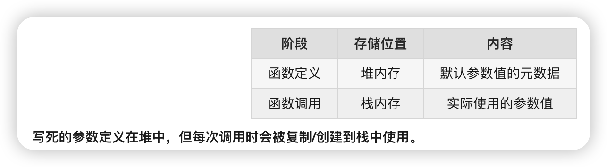

# 函数组成

```
const fn = function() {
  console.log('hello');
};

// 术语对照：
// - function() { ... }  → 函数表达式（function expression）
// - { console.log('hello'); }  → 函数体（function body）
// - fn 指向的对象  → 函数对象 / 函数实例（Function 的实例）

```


```
**准确回答**：

- `function(){}` **不叫**"函数体"，它是**函数表达式**
- `{}` 里面的内容才叫**函数体**（function body）
- `function(){}` 创建的对象**可以叫**"实例"（Function 的实例）✅

所以：`function(){}` = 函数表达式 = 创建了一个函数实例，但它本身不叫"函数体"
```


函数的存储位置

```
┌─────────────────────────────────────────────────────────┐
│                      栈内存 (Stack)                      │
├─────────────────────────────────────────────────────────┤
│  myFunc = 0x100 ────────┐  (存储的是指向函数的引用)      │
│  add = 0x200 ───────────┼──┐                            │
└─────────────────────────┼──┼────────────────────────────┘
                          │  │
                          ▼  ▼
┌─────────────────────────────────────────────────────────┐
│                      堆内存 (Heap)                       │
├─────────────────────────────────────────────────────────┤
│  0x100: function myFunc() { ... }  ← 函数对象本身        │
│  0x200: function add() { ... }     ← 函数对象本身        │
└─────────────────────────────────────────────────────────┘


```


调用栈

```
┌─────────────────────────────────────────────────────────┐
│              调用栈 (Call Stack) - 栈内存                 │
├─────────────────────────────────────────────────────────┤
│  ┌─────────────────────────────────────────────┐        │
│  │ inner() 执行上下文                           │        │
│  │   count = 5                                 │        │
│  │   外部引用 → outer 的词法环境                │        │
│  └─────────────────────────────────────────────┘        │
│  ┌─────────────────────────────────────────────┐        │
│  │ outer() 执行上下文                           │        │
│  │   num = 10                                  │        │
│  │   obj = 0x001 ──────────────┐               │        │
│  │   inner = 0x002 ────────────┼──┐            │        │
│  └─────────────────────────────┼──┼────────────┘        │
│  ┌─────────────────────────────┼──┼────────────┐        │
│  │ 全局执行上下文               │  │            │        │
│  │   outer = 0x003 ────────────┼──┼──┐         │        │
│  └─────────────────────────────┼──┼──┼─────────┘        │
└─────────────────────────────────┼──┼──┼─────────────────┘
                                  │  │  │
                                  ▼  ▼  ▼
┌─────────────────────────────────────────────────────────┐
│                      堆内存 (Heap)                       │
├─────────────────────────────────────────────────────────┤
│  0x001: { name: 'Alice' }                               │
│  0x002: function inner() { ... }                        │
│  0x003: function outer() { ... }                        │
└─────────────────────────────────────────────────────────┘

```


函数参数的存储位置

```
const fn = (x = { count: 0 }) => {
  x.count++;
  return x;
};

let a = fn();  // 创建新对象
let b = fn();  // 创建另一个新对象

console.log(a === b);  // false - 每次调用创建新对象
console.log(a.count);  // 1
console.log(b.count);  // 1


```

